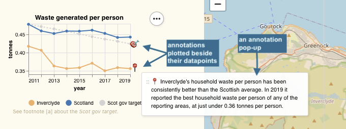

= Annotating data points on our prototype website

On our _requirements_ list is, to weave interest-based navigation maps through our data site.
And feedback from the recent http://sodu.live/[SODU 2021] conference, affirmed this:

> I like the site's tools and visualisations, but more needs to be done to help me navigate my path of interest through the prototype website.

In an exploratory step towards fulfilling that _requirement_,
we have annotated some data points with explanations/narrative.
The idea is that that these annotations could become waymarks in a navigation maps,
to guide users between the datapoints which underpin data-based stories.
We might even imagine how clicking a 'next' button on a waymark
would visually 'fly' the user to the next datapoint in the story
(which is, perhaps, on a different graph or different page).
But(!) back to our present, very simple proof-of-concept implementation...

Here's how the annotations look in our present, proof-of-concept implementation:

Each annotation is depicted by an emoji which is plotted beside a datapoint (on a graph, or in a table).
When the user hovers over (or clicks on) an annotation's emoji, a pop-up will display some informative text.

We want to code annotations just as we would any other dataset - as a straighforward CSV file.
So we have built a data-drive annotation mechanism.
This has allowed us to specify annotations, as data, in a CSV file like this:

Each annotation record contains `datapoint coordinates` which specify the datapoint against which the annotation is to be plotted. The `datapoint coordinates` include a `record-type` which specifies the dataset against which the annotation is to be plotted. (In this example,
the specified dataset `household-waste-derivation-generation` is a _derived_ dataset, based on the https://github.com/data-commons-scotland/dcs-easier-open-data/blob/master/data/README.adoc#household[`household-waste`] 
and 
https://github.com/data-commons-scotland/dcs-easier-open-data/blob/master/data/README.adoc#population[`population`] datasets.)

This proof-of-concept, data-driven, annotation mechanism has been useful because it has:

[lowerroman]
. given us a model _with moving parts_ to learn from,
. provided hints about how annotations can be used to help users understand and navigate the data,
. shown us that we need more structure around the naming and storage of derived datasets (and their annotations), and
. uncovered the difficultlies of retro-fitting an annotations mechanism into our `prototype-6` website. (Annotations are displayed using off-the-shelf Vega-lite tooltips and Bulma CSS dropdowns, but these don't provide a satisfactory level of placement/control/interactivity. More customised webpage components will be needed to provide a better user experience.)

