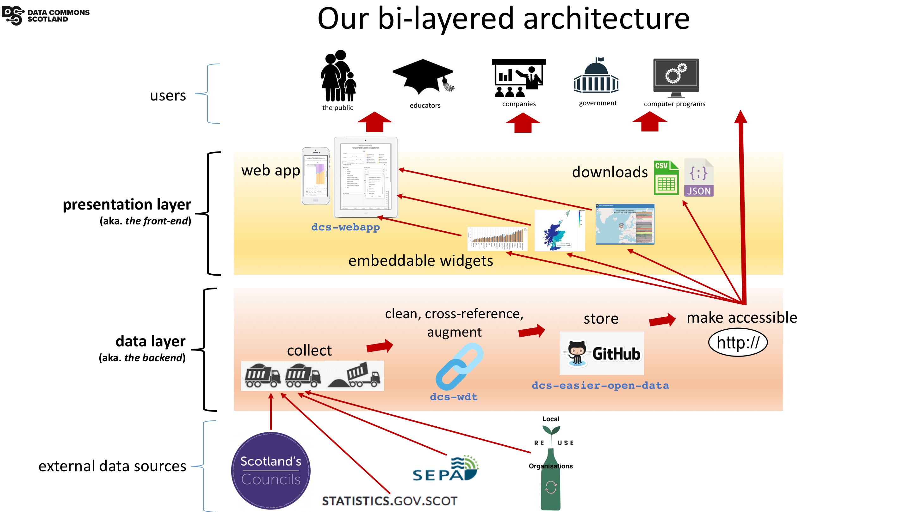

= The prototype's architecture - revised

https://github.com/data-commons-scotland/dcs-shorts/blob/master/wikibase-trial/README.adoc[+"Trialling Wikibase for our data layer"+,window=_blank]
described how we evaluated the use of Wikibase
as a key implementation component in our bi-layer architecture.
The conclusion was that Wikibase, although a brilliant product,
does not fit our immediate purpose.

In our revised architecture...

Wikibase is replaced with (https://github.com/data-commons-scotland/dcs-easier-open-data[dcs-easier-open-data]) a simple set
of data files (CSV and JSON) hosted in a public repository (GitHub).
These data files are generated by the Waste Data Tool (https://github.com/data-commons-scotland/dcs-wdt[dcs-wdt]).
Together, `dcs-easier-open-data` and `dcs-wdt` implement the architecture's data layer.

In the architecture's revised presentation layer,
the webapp reads (CSV/JSON formatted) data from the dcs-easier-open-data respository,
instead of reading (via SPARQL) data from the Wikibase.

