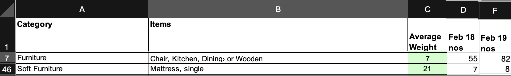
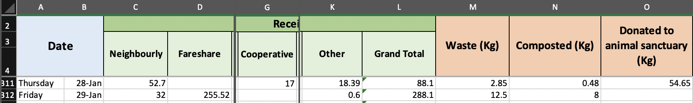
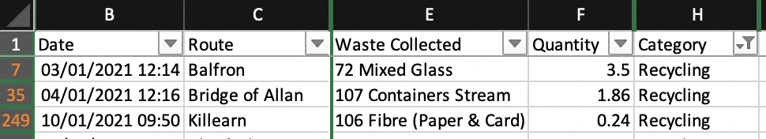

= Building linked open data about carbon savings
The Data Commons Scotland project; Greg Singh; Anna Wilson; Hannah Hamilton; Ashley McClenaghan
October 2021
:sectnums:
:xrefstyle: short
:section-refsig:
:icons: font
//:toc:
:keywords: LoD, OD, linked open data, CSVW, RDF, charty, 3rd sector, Scottish, Scotland, \
waste, reuse, recycle, carbon impact, carbon saving, CO2e, carbon metric, \
COP26, Swirrl, Blazegraph, Vega-lite, Clojure

This is a _walk-through_ of how we can build *linked open data* (LoD) about *carbon savings* from dissimilar data sources.

[#r-data]
== Reference data → CSV

The _carbon impact_ is a measure devised by 
https://www.zerowastescotland.org.uk/[Zero Waste Scotland] (ZWS), 
to convey the whole-life carbon impact of waste, from resource extraction and manufacturing emissions, right through to waste management emissions. 
Its unit-of-measure is _tonnes of carbon dioxide equivalent_ (CO~2~eT).

This is a reasonable basis for measuring carbon savings so we will use it as _reference data_.
 
It is defined in
https://www.zerowastescotland.org.uk/sites/default/files/The%20Scottish%20Carbon%20Metric.pdf[The Scottish Carbon Metric] document. 
For our purpose, its key data is in table 6.2.
This contains per-material weight-multipliers that can be used to calaculate CO~2~eT amounts. 

Here's a snipped image of that table:

image::carbon-metric-table-6_2-snippet.png["A snippet of the key data in The Scottish Carbon Metric", width=50%]

NOTE: This table's data has been published as linked open data by our project, in previous work.
See the `co2e-multiplier` files in https://github.com/data-commons-scotland/dcs-easier-open-data[this repo]. But we will redo that work here so that that we can provide an explanatory walk-through.

We copy the table's data from its original PDF format into a more tractable, 
CSV file: link:carbon-metric.csv[carbon-metric.csv].
Here's a snippet of data from that file:
 
[format="csv",options="header",width=50%]
|===================================================
include::carbon-metric.csv[lines="1..8"]
|===================================================

So, for our carbon savings data:

* link:carbon-metric.csv[carbon-metric.csv] will be referenced as the basis for calculations.
* CO~2~eT will be used as the primary unit-of-measure

For example, consider 1 tonne of (used) shoes...
[none]
* If these were landfilled at a waste site then the _carbon impact_ would be:
+
====
  (1 tonne) x (the `multiplier` value for `Footwear` from `carbon-metric.csv`)
= (1 tonne) x (31.17  CO2e) 
= 31.17 CO2eT
====

* Instead, if a reuse store sells them to its customers, it has made a _carbon saving_ of 31.17 CO2~e~T.

CAUTION: The term _carbon saving_ is a little misleading. A better name for it might be _carbon impact deferrals_ since all objects are eventually disposed of. But we won't pursue that philosphical totality in this document.

[#m-data]
== Measurement data → CSV

We take examples of meaurement data from 4 sources.

Their data is dissimilar, for example:

* emailed Excel files _vs._ CKAN hosted CSV files
* kilograms _vs._ tonnes
* various means of indicating a date
* various ways of categorising the stuff that gets reused. 

...but our end goal is to derive the same information from each of them.
This information can be seen in our target CSV file: link:carbon-savings.csv[carbon-savings.csv].
Here's a snippet of data from that file:

[format="csv",options="header"]
|===================================================
include::carbon-savings.csv[lines="1..2,8..8,10..10,13..13"]
|===================================================

To derive that CSV file, we do the following for each source:

[loweralpha]
. parse the essential values out of the source files
. derive and standardise values 
[lowerroman]
.. mapping text values into canonical _code lists_
.. appropriately scaling numbers
.. applying a standard format to dates
.. (encode source-specific data that would be useful to propogate, into the `enabler-specific` field)
. output as CSV.

[#tidy]
NOTE: Our process is basically: messy data → _tidy_ CSV data. +
The https://vita.had.co.nz/papers/tidy-data.html[Tidy Data] paper provides 
good rationale for and examples of this process, generalised.

=== Alloa Community Enterprises - reused furniture

image::https://raw.githubusercontent.com/data-commons-scotland/dcs-prototype-6/v1.5-beta/public/img/ace-furniture.png["Alloa Community Enterprises logo",width=60%,float=right]

https://ace.scot/[Alloa Community Enterprises]' (ACE) 
furniture reuse initiative has been running since 1984, helping prevent furniture from becoming waste.

ACE is in the process of publishing its data as open data. 
The following examples of measurement data have been taken from a *draft* of that work.

Here's a snipped image of ACE's measurement data:

The main steps in processing ACE's measurement data (the snippet shown above) are:

[loweralpha]
. Parse the essential values out of columns `A`-`D` & `F`
. Derive and standardise values ...
[lowerroman]
.. We map each pair of `Category` & `Items` values, to a `scottish-carbon-metric-material` value. 
We build this mapping table as a CSV file: link:ace-to-carbon-metric.csv[ace-to-carbon-metric.csv].
Here's a snippet of data from that file:
+
[format="csv",options="header"]
|===================================================
include::ace-to-carbon-metric.csv[lines="1..1,7..7,46..46"]
|===================================================
.. Multiple columns `D` & `F` by column `C` and divide by 1000, to calculate the `tonnes-weight` value.
.. Map the headers of columns `D` & `F`, to establish the `occurrence-date` value.
.. Capture furniture type & count information in the `enabler-specific` value.
+
. Output the end result as the CSV rows: 
+
[format="csv",options="header"]
|===================================================
include::carbon-savings.csv[lines="1..1,2..5"]
|=================================================== 

=== Stirling Community Food - redistributed food

image::https://raw.githubusercontent.com/data-commons-scotland/dcs-prototype-6/v1.5-beta/public/img/stirling-community-food.png["Stirling Community Food logo",width=60%,float=right]

https://www.transitionstirling.org.uk/community-food[Stirling Community Food]
 is a project that helps to reduce food waste in Stirling by collecting (from supermarkets & aggregators) excess and near-sell-by-date food, routing it away from waste bins, and making it available (for free) to the community.

Stirling Community Food is in the process of publishing its data as open data. 
The following examples of measurement data have been taken from a *draft* of that work. 

Here's a snipped image of Stirling Community Food's measurement data:

The main steps in processing Stirling Community Food's measurement data (the snippet shown above) are:

[loweralpha]
. Parse the essential values out of columns `A`-`O`
. Derive and standardise values ...
[lowerroman]
.. We map the 'outcomes' (i.e. how the food material got used) to a `scottish-carbon-metric-material` value. 
We build this mapping table as a CSV file: link:stirling-community-food-to-carbon-metric.csv[stirling-community-food-to-carbon-metric.csv].
Here's the data from that file:
+
[format="csv",options="header"]
|===================================================
include::stirling-community-food-to-carbon-metric.csv[]
|===================================================
+
.. Calaculate the total amounts of food materials for each of the outcome (converting from kgs to tonnes), to calculate the `tonnes-weight` value.
.. Interpret column `B` to establish the `occurrence-date` value.
.. Capture outcome information in the `enabler-specific` value.
. Output the end result as the CSV rows: 
+
[format="csv",options="header"]
|===================================================
include::carbon-savings.csv[lines="1..1,6..9"]
|=================================================== 

=== Stirling Council - household recycling bins

image::https://raw.githubusercontent.com/data-commons-scotland/dcs-prototype-6/v1.5-beta/public/img/looking-at-bin-collections.jpeg["Stirling Council logo",width=60%,float=right]

https://stirling.gov.uk/council-democracy/access-to-information/open-data/[Stirling Council] set a precedent by being the first (and still only) Scottish local authority to have published open data about their https://data.stirling.gov.uk/dataset/waste-management[bin collection of household waste]. 

The following examples of measurement data have been taken from that published data.

Here's a snipped image of Stirling Council's measurement data:

The main steps in processing Stirling Council's measurement data (the snippet shown above) are:

[loweralpha]
. Parse the essential values out of columns `B` - `C`, `E` - `F` & `H`
. Derive and standardise values ...
[lowerroman]
.. We map column `E` to to a `scottish-carbon-metric-material` value. 
We build this mapping table as a CSV file: link:stirling-council-to-carbon-metric.csv[stirling-council-to-carbon-metric.csv].
Here's a snippet of data from that file:
+
[format="csv",options="header"]
|===================================================
include::stirling-council-to-carbon-metric.csv[lines="1..1,4..5,8..8"]
|===================================================
+
.. Use column `F` as the `tonnes-weight` value.
.. Interpret column `B` to establish the `occurrence-date` value.
.. Note the `Route` information in the `enabler-specific` value.
. Output the end result as the CSV rows: 
+
[format="csv",options="header"]
|===================================================
include::carbon-savings.csv[lines="1..1,10..12"]
|=================================================== 

=== The Fair Share - reused student-oriented items

image::https://raw.githubusercontent.com/data-commons-scotland/dcs-prototype-6/v1.5-beta/public/img/fairshare.png["The Fair Share logo",width=60%,float=right]

https://www.stirlingstudentsunion.com/sustainability/fairshare/[The Fair Share] is a university based, reuse store. It accepts donations of second-hand books, clothes, kitchenware, electricals, etc. and sells these to students.

The Fair Share is in the process of publishing its data as open data. 
The following examples of measurement data have been taken from a *draft* of that work.

Here's a snipped image of The fair Share's measurement data:

image::the-fair-share-raw-snippet.png["A snippet of the measurement data in The Fair Share supplied Excel spreadsheet",width=70%]

The main steps in processing The Fair Share's measurement data (the snippet shown above) are:

[loweralpha]
. Parse the essential values out of columns `A` - `B`, & from the worksheet name
. Derive and standardise values ...
[lowerroman]
.. We map column `B` to to a `scottish-carbon-metric-material` value. 
We build this mapping table as a CSV file: link:the-fair-share-to-carbon-metric.csv[the-fair-share-to-carbon-metric.csv].
Here's a snippet of data from that file:
+
[format="csv",options="header"]
|===================================================
include::the-fair-share-to-carbon-metric.csv[]
|===================================================
+
.. Use column `B` divided by 1000, as the `tonnes-weight` value.
.. Map the worksheet's name to establish the `occurrence-date` value.
.. Note the university's semester in the `enabler-specific` value.
. Output the end result as the CSV rows: 
+
[format="csv",options="header"]
|===================================================
include::carbon-savings.csv[lines="1..1,13..17"]
|===================================================

== CSVs → linked data

=== CSVs may be good enough

In sections <<r-data>> & <<m-data>> 
we _re-worked_ the source data into CSV files 
with inconsistences rectified, text values mapped to cannocical code lists, 
and numeric & date values standardised.
The resulting CSVs may not be as detailed or have all the nuances as their source data
- but for the purpose of understanding _carbon savings_,
they are *easy to use*, understand, consume and parse.
Indeed, for many purposes and for use by non data experts, such CSVs will be good enough 
for publication as *open data* without further augmentation. 

===  Describing our data using linked data vocabularies 

Our CSVs have _implicit_ meaning and linking. E.g. 

* an `occurrence-date` value, _implicity_ has the semantics of being a _date_
* a `carbon-metric-material` value in the measurements CSV, _implicity_ is linked to the same `material` value in the reference data CSV.

For a standalone case study, this may be good enough
but, for our data to become part of the global linked data graph,
we need to define its semantics _explicitly_, in standardised way.
I.e. we need to describe our data using standard _linked data vocabularies_,
to explain to everyone how to interpret our data and how it is linked to other data.

=== Using CSVW

http://www.w3.org/TR/tabular-data-primer/[CSV on the Web] (CSVW)
is a standardised mechanism for associating linked data semantics/_metadata_ with CSV files.

It is nice because it allows us to keep our existing CSVs simple: unadulterated by
linked data complications. (Although the CSVs must be of the <<tidy,tidy>> kind,
as output from sections <<r-data>> & <<m-data>>.)

Let's create CSVW files to give our CSVs linked data semantics.

==== CSVW for our reference data

link:carbon-metric-metadata.json[carbon-metric-metadata.json]
contains the CSVW that gives linked data semantics to our reference data CSV.

Its feature of interest are described below.

[source,json]
----
include::carbon-metric-metadata.json[]
----

==== CSVW for our measurement data

link:carbon-savings-metadata.json[carbon-savings-metadata.json]
contains the CSVW that gives linked data semantics to our measurement data CSV.

Its feature of interest are described below.

[source,json]
----
include::carbon-savings-metadata.json[]
----

=== Generating RDF

== Publishing it as open data

== Using it

== Next?

* Add other dimensions such as geographic region (sourced from? given to?)
* Adopt other vocabs? (statistical vocabs?)
* Support upload by enablers (upload -> validate -> add to the published LoD)
* Context: COP26 etc.

