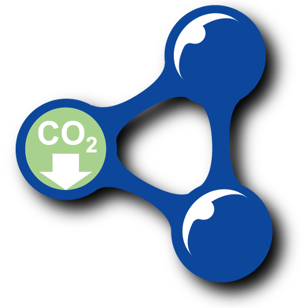
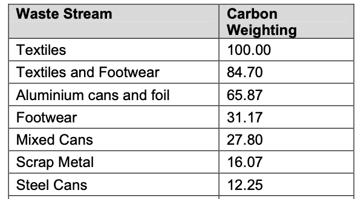
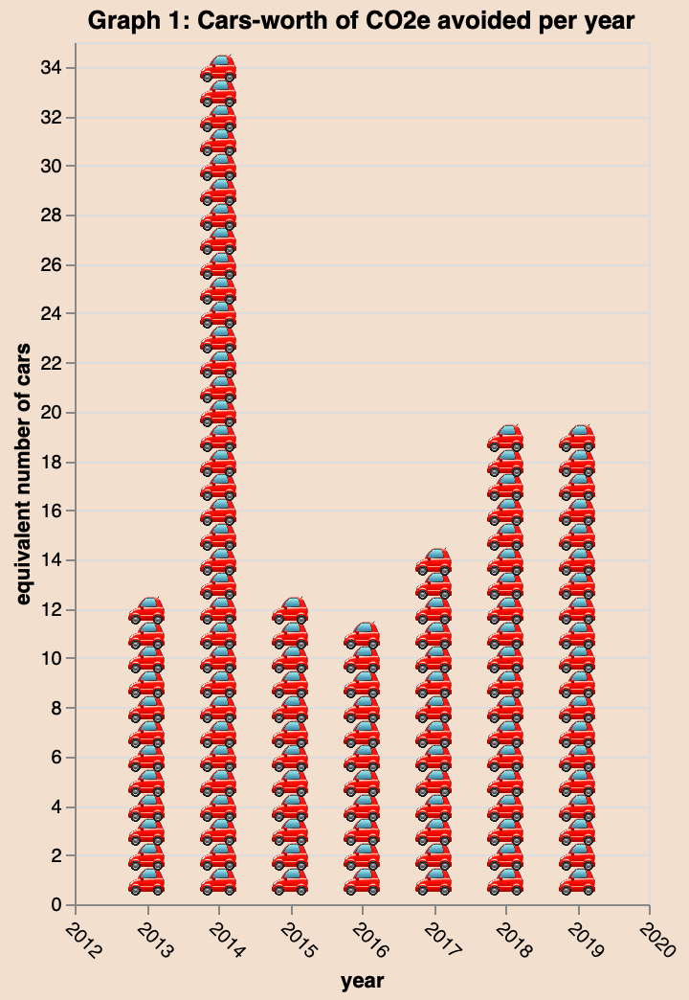

= Building linked open data about carbon savings
The Data Commons Scotland project; Greg Singh; Anna Wilson; Hannah Hamilton; Ashley McClenaghan
October 2021
:docinfo: shared
:favicon: ./img/favicon.ico
:source-highlighter: highlight.js
:highlightjs-theme: default
:highlightjs-languages: json, shell, sparql
:sectnums:
:xrefstyle: short
:section-refsig:
:icons: font
:toc:
:toclevels: 3
:keywords: LoD, OD, linked open data, CSVW, RDF, charty, 3rd sector, Scottish, Scotland, \
waste, reuse, recycle, carbon impact, carbon saving, CO2e, carbon metric, \
COP26, Swirrl, Blazegraph, Vega-lite, Clojure

.DRAFT
****
[.text-center]
An incomplete, early draft - still lots of TODOs.
****

[.float-group]
--

[.indent]
{nbsp} +
{nbsp} +
{nbsp} +
This is a _walk-through_ of how we can build *linked open data* (LoD) about *carbon savings* from dissimilar data sources.
--

[#m-data]
== Measurement data → CSV

=== Sources

We take examples of meaurement data from 4 sources:

[square]
- Alloa Community Enterprises - reused furniture
- Stirling Community Food - redistributed food
- Stirling Council - household recycling bins
- The Fair Share - reused, student-oriented items.

=== Deriving the same information from the dissimilar sources

Their data is dissimilar, for example:

* 3rd sector reporting _vs._ local government reporting
* emailed Excel files _vs._ CKAN hosted CSV files
* kilograms _vs._ tonnes
* various means of indicating dates
* various ways of categorising the stuff that gets reused. 

...but our end goal is to derive the same information from each of them.
This information can be seen in the CSV file that contains the results of our efforts
in this section: link:data/carbon-savings.csv[carbon-savings.csv].
Here's a snippet of data from that file:

[format="csv",options="header"]
|===================================================
include::data/carbon-savings.csv[lines="1..2,8..8,10..10,13..13"]
|===================================================

=== The process

To derive that CSV file, we do the following for each source:

[loweralpha]
. parse the essential values out of the source files
. derive and standardise values 
[lowerroman]
.. mapping text values into controlled, canonical _code lists_
(e.g. the Scottish Carbon Metric's <<carbon-metric>> list of `materials`;
and our list of carbon-savings `enabler` organisations)
.. appropriately scaling numbers (e.g. weight amounts to `tonnes`)
.. applying a standard format to dates
.. encode source-specific data that would be useful to propogate, into the `enabler-specific` field
. output as CSV.

[#tidy]
NOTE: Our process is basically: messy data → _tidy_ CSV data. +
The Tidy Data paper <<tidy-data>> provides 
good rationale for and examples of this process, generalised.

=== Design decisions

* Use The Scottish Carbon Metric <<carbon-metric>> as the basis for measuring carbon savings.
This is refered to via the `scottish-carbon-metric-material` column; and we will discuss it
further in section <<r-data>>. 
* Accounting & reporting procedures often batch into a single carbon-savings record, 
all of the instances of _same material-class_ reuse/recycling that have
occurred within an interval of time.
The `occurrence-date` column captures the end date of those intervals.
* Include the `enabler-specific` column to allow ``enabler``s to:
propogate additional information; and to report 
measurements at an additional level of granularity (see the <<additional-granularity,primary key>> explanation, later).
* Reduce "double accounting" by trying to ensure that:
the data contains no records where
one carbon savings `enabler` 'feeds' the same reuse/recycling item to another `enabler`, 
within some (significant-for-use) duration.

=== Per-source _walk-throughs_

In this section we walk-through the _measurement data → CSV_ process, for each source; 
outlining some per-source specifics.

==== Alloa Community Enterprises - reused furniture

image::https://raw.githubusercontent.com/data-commons-scotland/dcs-prototype-6/v1.5-beta/public/img/ace-furniture.png["Alloa Community Enterprises logo",width=60%,float=right,align=center]

https://ace.scot/[Alloa Community Enterprises^]' (ACE) 
furniture reuse initiative has been running since 1984, helping prevent furniture from becoming waste.

ACE is in the process of publishing its data as open data. 
The following *samples* of measurement data have been taken from a draft of that work.

Here's a snipped image of ACE's measurement data:

image::img/ace-raw-snippet.png["A snippet of the measurement data in the Alloa Community Enterprises supplied Excel spreadsheet"]

The main steps in processing ACE's measurement data (the snippet shown above) are:

[loweralpha]
. Parse the essential values out of columns `A`-`D` & `F`
. Derive and standardise values ...
[lowerroman]
.. We map each pair of `Category` & `Items` values, to a `scottish-carbon-metric-material` value. 
We build this mapping table as a CSV file: link:mapping/ace-to-carbon-metric.csv[ace-to-carbon-metric.csv].
Here's a snippet of data from that file:
+
[format="csv",options="header"]
|===================================================
include::mapping/ace-to-carbon-metric.csv[lines="1..1,7..7,46..46"]
|===================================================
.. Multiple columns `D` & `F` by column `C` and divide by 1000, to calculate the `tonnes-weight` value.
.. Map the headers of columns `D` & `F`, to establish the `occurrence-date` value.
.. Capture furniture type & count information in the `enabler-specific` value.
+
. Output the end result as the CSV rows: 
+
[format="csv",options="header"]
|===================================================
include::data/carbon-savings.csv[lines="1..1,2..5"]
|=================================================== 

==== Stirling Community Food - redistributed food

image::https://raw.githubusercontent.com/data-commons-scotland/dcs-prototype-6/v1.5-beta/public/img/stirling-community-food.png["Stirling Community Food logo",width=60%,float=right,align=center]

https://www.transitionstirling.org.uk/community-food[Stirling Community Food^]
 is a project that helps to reduce food waste in Stirling by collecting (from supermarkets & aggregators) excess and near-sell-by-date food, routing it away from waste bins, and making it available (for free) to the community.

Stirling Community Food is in the process of publishing its data as open data. 
The following *samples* of measurement data have been taken from a draft of that work. 

Here's a snipped image of Stirling Community Food's measurement data:

image::img/stirling-community-food-raw-snippet.png["A snippet of the measurement data in the Stirling Community Food supplied Excel spreadsheet"]

The main steps in processing Stirling Community Food's measurement data (the snippet shown above) are:

[loweralpha]
. Parse the essential values out of columns `A`-`O`
. Derive and standardise values ...
[lowerroman]
.. We map the 'outcomes' (i.e. how the food material got used) to a `scottish-carbon-metric-material` value. 
We build this mapping table as a CSV file: link:mapping/stirling-community-food-to-carbon-metric.csv[stirling-community-food-to-carbon-metric.csv].
Here's the data from that file:
+
[format="csv",options="header"]
|===================================================
include::mapping/stirling-community-food-to-carbon-metric.csv[]
|===================================================
+
.. Calaculate the total amounts of food materials for each of the outcome (converting from kgs to tonnes), to calculate the `tonnes-weight` value.
.. Interpret column `B` to establish the `occurrence-date` value.
.. Capture outcome information in the `enabler-specific` value.
. Output the end result as the CSV rows: 
+
[format="csv",options="header"]
|===================================================
include::data/carbon-savings.csv[lines="1..1,6..9"]
|=================================================== 

==== Stirling Council - household recycling bins

image::https://raw.githubusercontent.com/data-commons-scotland/dcs-prototype-6/v1.5-beta/public/img/looking-at-bin-collections.jpeg["Stirling Council logo",width=60%,float=right,align=center]

https://stirling.gov.uk/council-democracy/access-to-information/open-data/[Stirling Council^] set a precedent by being the first (and still only) Scottish local authority to have published open data about their https://data.stirling.gov.uk/dataset/waste-management[bin collection of household waste^]. 

The following *samples* of measurement data have been taken from that published data.

Here's a snipped image of Stirling Council's measurement data:

image::img/stirling-council-raw-snippet.png["A snippet of the measurement data in the Stirling Council CKAN supplied CSV",width=70%]

The main steps in processing Stirling Council's measurement data (the snippet shown above) are:

[loweralpha]
. Parse the essential values out of columns `B` - `C`, `E` - `F` & `H`
. Derive and standardise values ...
[lowerroman]
.. We map column `E` to to a `scottish-carbon-metric-material` value. 
We build this mapping table as a CSV file: link:mapping/stirling-council-to-carbon-metric.csv[stirling-council-to-carbon-metric.csv].
Here's a snippet of data from that file:
+
[format="csv",options="header"]
|===================================================
include::mapping/stirling-council-to-carbon-metric.csv[lines="1..1,4..5,8..8"]
|===================================================
+
.. Use column `F` as the `tonnes-weight` value.
.. Interpret column `B` to establish the `occurrence-date` value.
.. Note the `Route` information in the `enabler-specific` value.
. Output the end result as the CSV rows: 
+
[format="csv",options="header"]
|===================================================
include::data/carbon-savings.csv[lines="1..1,10..12"]
|=================================================== 

==== The Fair Share - reused, student-oriented items

image::https://raw.githubusercontent.com/data-commons-scotland/dcs-prototype-6/v1.5-beta/public/img/fairshare.png["The Fair Share logo",width=60%,float=right,align=center]

https://www.stirlingstudentsunion.com/sustainability/fairshare/[The Fair Share^] is a university based, reuse store. It accepts donations of second-hand books, clothes, kitchenware, electricals, etc. and sells these to students.

The Fair Share is in the process of publishing its data as open data. 
The following *samples* of measurement data have been taken from a draft of that work.

Here's a snipped image of The fair Share's measurement data:

image::img/the-fair-share-raw-snippet.png["A snippet of the measurement data in The Fair Share supplied Excel spreadsheet",width=70%]

The main steps in processing The Fair Share's measurement data (the snippet shown above) are:

[loweralpha]
. Parse the essential values out of columns `A` - `B`, & from the worksheet name
. Derive and standardise values ...
[lowerroman]
.. We map column `B` to to a `scottish-carbon-metric-material` value. 
We build this mapping table as a CSV file: link:mapping/the-fair-share-to-carbon-metric.csv[the-fair-share-to-carbon-metric.csv].
Here's a snippet of data from that file:
+
[format="csv",options="header"]
|===================================================
include::mapping/the-fair-share-to-carbon-metric.csv[]
|===================================================
+
.. Use column `B` divided by 1000, as the `tonnes-weight` value.
.. Map the worksheet's name to establish the `occurrence-date` value.
.. Note the university's semester in the `enabler-specific` value.
. Output the end result as the CSV rows: 
+
[format="csv",options="header"]
|===================================================
include::data/carbon-savings.csv[lines="1..1,13..17"]
|===================================================

[#r-data]
== Reference data → CSVs

In this section we walk-through building our two reference (_axiomatic_) data CSVs.

=== Carbon metric

The _carbon impact_ is a measure devised by 
https://www.zerowastescotland.org.uk/[Zero Waste Scotland^] (ZWS), 
to convey the whole-life carbon impact of waste, from resource extraction and manufacturing emissions, right through to waste management emissions. 
Its unit-of-measure is _tonnes of carbon dioxide equivalent_ (CO~2~eT).

This is a reasonable basis for measuring carbon savings so we will use it as _reference data_.
 
It is defined in
The Scottish Carbon Metric document <<carbon-metric>>. 
For our purpose, its key data is in table 6.2.
This contains per-material weight-multipliers that can be used to calaculate CO~2~eT amounts. 

Here's a snipped image of that table:

NOTE: This table's data has been published as linked open data by our project, in previous work.
See the `co2e-multiplier` files in https://github.com/data-commons-scotland/dcs-easier-open-data[this Git repo^]. But we will redo that work here so that that we can provide an explanatory walk-through.

We copy the table's data from its original PDF format into a more tractable, 
CSV file: link:data/carbon-metric.csv[carbon-metric.csv].
Here's a snippet of data from that file:
 
[format="csv",options="header",width=50%]
|===================================================
include::data/carbon-metric.csv[lines="1..8"]
|===================================================

So, for our carbon savings data:

* link:data/carbon-metric.csv[carbon-metric.csv] will be referenced as the basis for calculations.
* CO~2~eT will be used as the primary unit-of-measure

For example, consider 1 tonne of (used) shoes...
[none]
* If these were landfilled at a waste site then the _carbon impact_ would be:
+
====
  (1 tonne) x (the `multiplier` value for `Footwear` from `carbon-metric.csv`)
= (1 tonne) x (31.17  CO2e) 
= 31.17 CO2eT
====

* Instead, if a reuse store sells them to its customers, it has made a _carbon saving_ of 31.17 CO2~e~T.

CAUTION: The term _carbon saving_ is a little misleading. A better name for it might be _carbon impact deferrals_ since all objects are eventually disposed of. But we won't pursue that philosphical totality in this document.

=== Enabler organisations

We describe the `enabler` organisations in link:data/enablers.csv[enablers.csv].
Here's the data from that file:

[format="csv",options="header",width=75%]
|===================================================
include::data/enablers.csv[]
|===================================================

== CSVs → linked data

=== CSVs may be good enough

In sections <<r-data>> & <<m-data>> 
we _re-worked_ the source data into CSV files 
with inconsistences rectified, text values mapped to cannocical code lists, 
and numeric & date values standardised.
The resulting CSVs may not be as detailed or have all the nuances as their source data
- but for the purpose of understanding _carbon savings_,
they are *easy to use*, understand, consume and parse.
Indeed, for many purposes and for use by non data experts, such CSVs will be good enough 
for publication as *open data* without further augmentation. 

===  Describing our data using linked data vocabularies 

Our CSVs have _implicit_ meaning and linking. E.g. 

* an `occurrence-date` value, _implicity_ has the semantics of being a _date_
* a `carbon-metric-material` value in the measurements CSV, _implicity_ is linked to the same `material` value in the reference data CSV.

For a standalone case study, this may be good enough
but, for our data to become part of the global linked data graph <<linked-data>>,
we need to define its semantics _explicitly_, in standardised way.
I.e. we need to describe our data using standard _linked data vocabularies_,
to explain to everyone how to interpret our data and how it is linked to other data.

=== Using CSVW

CSV on the Web (CSVW) <<CSVW>>
is a standardised mechanism for associating linked data semantics/_metadata_ with CSV files.

It is nice because it allows us to keep our existing CSVs simple: unadulterated by
linked data complications. (Although the CSVs must be of the _tidy_ kind <<tidy-data>>,
as output from sections <<r-data>> & <<m-data>>.)

Let's create CSVW files to give our CSVs linked data semantics.

==== CSVW for the `carbon-metric` reference data

link:csvw/carbon-metric-metadata.json[carbon-metric-metadata.json]
contains the CSVW that gives linked data semantics to the 
link:data/carbon-metric.csv[carbon-metric.csv] reference data.

Its features of interest are described below.

[source,json]
----
include::csvw-annotated/carbon-metric-metadata.annotated-json[]
----

<1> Assign standard (https://www.w3.org/2001/XMLSchema[XMLSchema^]) data types to each of the CSV's columns.
<2> Define a new RDF https://www.w3.org/TR/rdf11-concepts/#dfn-predicate[predicate^] for each of the CSV's columns.
<3> Declare the `multiplier` value to be mandatory. 
<4> Define the _virtual_, standard predicate https://www.w3.org/TR/rdf-schema/#ch_type[rdf:type^] to say what _class_ these rows are. 
<5> Declare the `material` value to be the primary key (and to be mandatory).
<6> Define how to construct the https://www.w3.org/TR/rdf-concepts/#section-Graph-URIref[URI^] (unique identifier) for each of the CSV's rows. 

==== CSVW for the `enablers` reference data

link:csvw/enablers-metadata.json[enablers-metadata.json]
contains the CSVW that gives linked data semantics to the 
link:data/enablers.csv[enablers.csv] reference data.

Its new (not previously discussed) features of interest are described below.

[source,json]
----
include::csvw-annotated/enablers-metadata.annotated-json[]
----

<1> The `latitude` and `longitude` values are optional, by CSVW default.  

==== CSVW for the `carbon-savings` measurement data

link:csvw/carbon-savings-metadata.json[carbon-savings-metadata.json]
contains the CSVW that gives linked data semantics to the 
link:data/arbon-savings.csv[carbon-savings.csv] measurement data.

Its new (not previously discussed) features of interest are described below.

[source,json]
----
include::csvw-annotated/carbon-savings-metadata.annotated-json[]
----

<1> Declare the `material` & `enabler` values to be, in essence, links into the  
the `carbon-metric` & `enablers` data.
<2> [[additional-granularity]] The primary key is a composite.
Including `enablerSpecific` as a component of the primary key, 
allows the possibility for the `enabler` to report measurements at an
additional level of granularity.

[#gen]
=== Generating an RDF graph

We use https://www.swirrl.com[Swirrl^]'s useful
https://github.com/Swirrl/csv2rdf[csv2rdf^] tool to generate a linked data/RDF graph of our data:

[source,shell]
----
$ ls data/
carbon-metric.csv	carbon-savings.csv	enablers.csv <1>

$ ls csvw/
carbon-metric-metadata.json	carbon-savings-metadata.json	enablers-metadata.json <1>

$ ./csv2rdf-0.4.6 -m minimal -t data/carbon-savings.csv -u csvw/carbon-savings-metadata.json -o rdf/carbon-savings.ttl <2>
$ ./csv2rdf-0.4.6 -m minimal -t data/carbon-metric.csv -u csvw/carbon-metric-metadata.json -o rdf/carbon-metric.ttl <2>
$ ./csv2rdf-0.4.6 -m minimal -t data/enablers.csv -u csvw/enablers-metadata.json -o rdf/enablers.ttl <2>

$ ls rdf/
carbon-metric.ttl	carbon-savings.ttl	enablers.ttl <3>
----

<1> The inputs: +
{nbsp}{nbsp}{nbsp}{nbsp} the CSV files containing the actual data, and +
{nbsp}{nbsp}{nbsp}{nbsp} the CSVW files providing the linked data semantics/_metadata_. 
<2> Run the `csv2rdf` tool against each CSV+CSVW input pairing.
<3> The output: Turtle (`.ttl`) files which define an RDF graph of our data: +
{nbsp}{nbsp}{nbsp}{nbsp} link:rdf/carbon-savings.ttl[carbon-savings.ttl] +
{nbsp}{nbsp}{nbsp}{nbsp} link:rdf/carbon-metric.ttl[carbon-metric.ttl] +
{nbsp}{nbsp}{nbsp}{nbsp} link:rdf/enablers.ttl[enablers.ttl]

== Using the linked data
 
The linked data/RDF graph is defined by the Turtle files that we generated in section <<gen>>.
To help us examine and query the RDF graph, we use the
https://github.com/blazegraph/database[Blazegraph^] tool.

First we load our Turtle files into Blazegraph's data store:

[source,shell]
----
$ java -cp blazegraph.jar com.bigdata.rdf.store.DataLoader journal.properties rdfdir/*.ttl
...
Reading properties: journal.properties
Will load from: rdf/carbon-metric.ttl
Will load from: rdf/carbon-savings.ttl
Will load from: rdf/enablers.ttl
...
Load: 223 stmts added in 0.251 secs, rate= 888, commitLatency=0ms, {failSet=0,goodSet=3}
----

Then we run Blazegraph's graph engine and SPARQL query service:

[source,shell]
----
$ java -server -Xmx4g -jar blazegraph.jar
...
Welcome to the Blazegraph(tm) Database.

Go to http://192.168.1.106:9999/blazegraph/ to get started.
----

Opening that URL in a web browser, gives us a UI allowing us to exaime and query our RDF graph:

image::img/blazegraph-ui.png["Blazegraph's web UI"]

<1> Enter a SPARQL query. This example finds `carbon-savings` records then returns the specified field values.
<2> See the results of that query.

=== TODO

Provide 2 usage examples that are based on larger samples of our datasets:

* A SPARQL inference example
* A graph for each source, depicting carbon savings in terms of cars/planes journeys/etc.
+

== Concluding remarks

We finish with some open questions, points of interest arising, and ideas for future development.

=== Vocabularies, naming and structuring

Since we're dealing with measurement data, should we adopt _statistical_ RDF vocabularities 
such as https://www.w3.org/TR/vocab-data-cube/[Data Cube^] 
and https://sdmx.org/?page_id=2555/[SDMX^]? We could use these to descibe additonal aspects 
of our data (e.g. to assocate `material` with the exact concept of SDMX's code list; to explicitly differentiate between identification and measurement dimension; to say more about our unit of measure). However, these would complicate the data model
and, for our purpose, be more of a hinderance than a help.

CSVW _bakes in_ support for vocabularies such as 
http://dublincore.org/documents/dcmi-terms/[Dublin Core^]
and http://schema.org/[schema.org^].
This makes it convenient to add
`dc:description` and `schema:latitude` annotations/explanations to the data but, 
we haven't made use of this.

Should the class `carbon-metric` have been named `co2e-multipler`
to reflect the more specific purpose of its data?
And then, its `hasMaterial` property be redefined as `rdfs:label`? 
Naming and structuring the data is very important but,
it isn't the focus of this piece of work, 
so we didn't _go all round the houses_ to get it right here.

=== Be careful when comparing

This work is exploratory and uses small, non-comparable samples of data. 
If it were to be put into practice and based on fuller operational data
then this approach could be used both to highlight and, to very roughly compare the 
carbon savings aspect of the `enabler` organisations.
When used of the latter purpose - comparison - care should be exercised
because of the dissimilar sizes of the `enabler` organisations and, 
dissimilar types of reuse materials. 
(Remember the laudable intent of the `enabler` organisations in their reuse work!)

On a more specific note about comparing:
The `carbon-savings` records report on different time intervals
so be careful to calculate comparable (say, per-day) amounts from the records. 

=== Support needed for composition, revision and provenance

As data becomes available, it should be possible to _compose_ it into an 
_accumulation_ of open linked data about carbon savings.

_Compose_ scenarios include:

* New data becoming available out-of-order.
* New data revising old data.
* New data conflicting with old data, where new and old have different provenances.  

There are many approaches (temporal databases, distributed ledgers, linked data event streams) and interesting solutions 
(https://flur.ee[Fluree^];
https://tree.linkeddatafragments.org[TREE^];
even https://git-scm.com/book/en/v2/Getting-Started-What-is-Git%3F[Git^] to some extent), 
that claim to support those _compose_ scenarios and their related concerns (including ordering, durability, availablity, identity, consensus, and branching).

However, using any of them would be future work.

=== Possible development

Would it be useful to build on this?

Basis for an _app_?

If we develop a prototype _app_ for collecting and publishing carbon savings data
(along the lines of this exploratory walk through) 
then...

* publishing it as open data (e.g. on GitHub) - dump vs API

* Support upload by enablers (upload -> validate -> add to the published LoD)

* Of interest to people given this century's environmental concerns
and the COP26 climate conference in Scotland?

[bibliography]
== References

* [[[carbon-metric]]] Zero Waste Scotland.
https://www.zerowastescotland.org.uk/sites/default/files/The%20Scottish%20Carbon%20Metric.pdf[The Scottish Carbon Metric^]. 2011.
* [[[tidy-data]]] Hadley Wickham. https://vita.had.co.nz/papers/tidy-data.html[Tidy data^]. 2014.
* [[[linked-data]]] Tim Berners-Lee. https://www.w3.org/DesignIssues/LinkedData.html/[Linked Data^]. 2006.
* [[[CSVW]]] W3C. https://www.w3.org/TR/tabular-data-primer[CSV on the Web: A Primer^]. 2016. 
