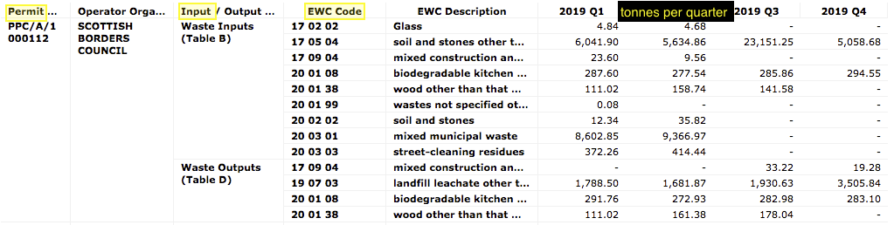
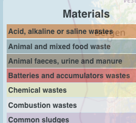
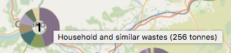
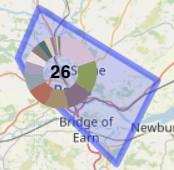
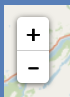

= Waste sites and the quantities of incoming materials

== The dataset

SEPA publish a "Site returns" dataset
(accessible via their https://www.sepa.org.uk/data-visualisation/waste-sites-and-capacity-tool[Waste sites and capacity tool])
that says how many tonnes of each
(https://eur-lex.europa.eu/legal-content/EN/TXT/HTML/?uri=CELEX:02000D0532-20150601&from=EN#tocId7[EWC] coded)
waste material was moved in or out of each authorised waste site in Scotland. Here is an extract...

This is impressive ongoing data collection and curation by SEPA.

_But might some of its information be made more understandable to the general public by depicting it on a map?_

Towards answering that, we built a prototype webapp.
For speed of development, we considered only the materials incoming to waste sites during the year 2019.

== Data mapping

To aid comprehension, SEPA often _sorts_ waste materials into 33 categories.
We do the same in our prototype, mapping each EWC coded waste material into 1 of the 33 categories...

The "Site returns" dataset identifies waste sites by their Permit/Licence code.
We want our prototype to show additional information about each waste site:
its name, council area, waste processing activities, client types,
and location - very important for our prototype's map-based display!

Usually, SEPA holds that additional information within its "Waste sites and capacity summary" dataset
(also accessible via their https://www.sepa.org.uk/data-visualisation/waste-sites-and-capacity-tool[Waste sites and capacity tool]).
Our prototype uses the Permit/Licence codes to cross-reference between the 2 SEPA datasets.

SEPA provides the waste site locations as National Grid _eastings and northings_.
However, it is easier to use latitude and longitude coordinates in the chosen map display technology
so our prototype uses https://github.com/dilico/geocoordinates[Colantoni's library] to perform
the conversion.

== The prototype webapp

A 'live' instance of the resulting prototype webapp can be accessed https://data-commons-scotland.github.io/cluster-map-of-materials-incoming/[*here*].

Below is an animated image of it...

image::cluster-map-animated-fuller.gif["our prototype webapp", align="center", width="95%"]

* Each pie chart depicts the amounts of materials incoming to a single waste site,
or to the aggregation of waste sites within a map area.
**  Depicts a single waste site.
**  Depicts an aggregation of 26 waste sites.

*  (I.e. a number without a surrounding pie chart) depicts a waste site
with no incoming materials (probably because the site was not operational during 2019).

*  Hovering the cursor over a pie segment will pop-up
details about incoming tonnes of the material depicted by the segment.

*  Hovering the cursor over a pie that
depicts an aggregation will highlight the map area in which the aggregated waste sites are located.

* image:waste-site-popup.png[waste site pop-up, width=300]
Clicking on a single waste site will pop-up details about that waste site.

* 
The webapp supports the usual zoom and pan controls.
The user can also double-click on an aggregation pie to zoom into the area that it _covers_.

* 
Clicking on 'attributions' will display a page that credits:
** https://www.sepa.org.uk/[SEPA] for its "Site returns" dataset.
** http://openstreetmap.org/[Open Street Map] for the map data.
** https://leafletjs.com/[Leaflet], https://github.com/Leaflet/Leaflet.markercluster[Leaflet.markercluster]
and https://www.researchgate.net/profile/Bard_Romstad[Bård Romstad] for the software.

