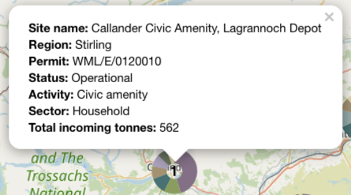
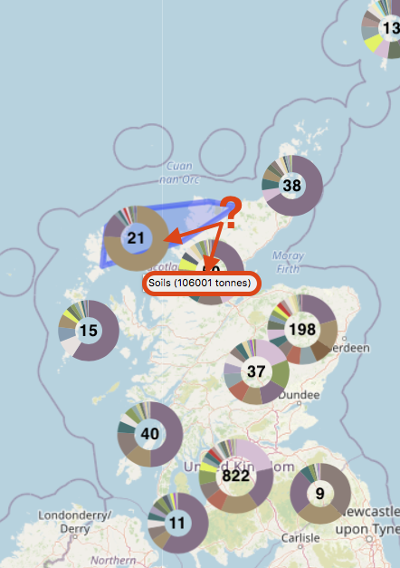
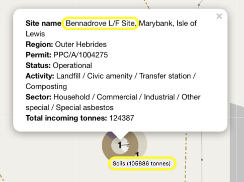

= Waste sites and the quantities of incoming materials

== The dataset

SEPA publish a "Site returns" dataset
(accessible via their https://www.sepa.org.uk/data-visualisation/waste-sites-and-capacity-tool[Waste sites and capacity tool])
that says...

* how many tonnes
* of each
(https://eur-lex.europa.eu/legal-content/EN/TXT/HTML/?uri=CELEX:02000D0532-20150601&from=EN#tocId7[EWC] coded)
waste material
* was moved in or out
* of each authorised waste site in Scotland.

Here is an extract...

This is impressive, ongoing data collection and curation by SEPA.

_But might some of its information be made more understandable to the general public by depicting it on a map?_

Towards answering that, we built a prototype webapp.
(For speed of development, we considered only the materials incoming to waste sites during the year 2019.)

== Data mapping

To aid comprehension, SEPA often _sorts_ waste materials into 33 categories.
We do the same in our prototype, mapping each EWC coded waste material into 1 of the 33 categories...

The "Site returns" dataset identifies waste sites by their Permit/Licence code.
We want our prototype to show additional information about each waste site.
Specifically, its name, council area, waste processing activities, client types,
and location - very important for our prototype's map-based display!

SEPA holds that additional information about waste sites,
in a 2nd dataset: "Waste sites and capacity summary"
(also accessible via their https://www.sepa.org.uk/data-visualisation/waste-sites-and-capacity-tool[Waste sites and capacity tool]).
Our prototype uses the Permit/Licence codes to cross-reference between the 2 SEPA datasets.

SEPA provides the waste site locations as National Grid _eastings and northings_.
However, it is easier to use latitude & longitude coordinates in our chosen map display technology
so, our prototype uses https://github.com/dilico/geocoordinates[Colantoni's library] to perform
the conversion.

== The prototype webapp

A 'live' instance of the resulting prototype webapp can be accessed https://data-commons-scotland.github.io/cluster-map-of-materials-incoming/[*here*].

Below is an animated image of it...

image::cluster-map-animated-fuller.gif["our prototype webapp", align="center", width="95%"]

=== UI & controls

* Each pie chart depicts the amounts of materials incoming to a single waste site,
or the aggregation of waste sites within a map area.
**  Depicts a single waste site.
** image:multi-waste-sites-pie.png[multiple waste sites pie] Depicts an aggregation of 26 waste sites.

* image:no-pie.png[no pie] (I.e. a number without a surrounding pie chart) depicts a waste site
with no incoming materials (probably because the site was not operational during 2019).

*  Hovering the cursor over a pie segment will pop-up
details about incoming tonnes of the material depicted by the segment.

* image:area-highlighting.png[area highlighting, width=150] Hovering the cursor over a pie that
depicts an aggregation will highlight the map area in which the aggregated waste sites are located.

* 
Clicking on a single waste site will pop-up details about that waste site.

* 
The webapp supports the usual zoom and pan controls.
The user can also double-click on an aggregation pie to zoom into the area that it _covers_.

* 
Clicking on 'attributions' will display a page that credits:
** https://www.sepa.org.uk/[SEPA] for its "Site returns" dataset.
** http://openstreetmap.org/[Open Street Map] for the map data.
** https://leafletjs.com/[Leaflet], https://github.com/Leaflet/Leaflet.markercluster[Leaflet.markercluster]
and https://www.researchgate.net/profile/Bard_Romstad[Bård Romstad] for the software libraries used
to build the prototype webapp.

== Closing thoughts

> _But might some of its information be made more understandable to the general public by depicting it on a map?_

For any good solution, the answer will be an obvious 'yes'.
But what about for our prototype webapp solution?...

We think that it could help pique interest in the differences in the
amounts & types of waste materials that are being disposed in different areas of the country.
For example...

[cols="<.^30%,<.^40%,<.^30%", grid="none", frame="none"]
|===

| Glancing at our prototype's map (image left; at the default zoom level),
the seemingly disproportionate amount of _soils & stones_ coming into north west Scotland waste sites
catches our attention. So we zoom in (right image) to find that almost all of it is accounted for
by one landfill site on the the Isle of Lewis.
| 
|===

Future work could increase the utility of this prototype webapp by:

* allowing the user to browse over the time-series aspect of this dataset using a _time slider control_
(like our
https://github.com/data-commons-scotland/dcs-shorts/tree/master/waste-quants-thru-time-on-a-map[through time on a map]
prototype)
* providing a means to switch the focus of interest from incoming material to: outgoing material,
processing activities (landfill, composting, metal recycling, etc.),
or facilities offered (household, commercial, special disposals, etc.)
* supporting filtering over the various dimensions
* providing the means for a user to open their current _data selection_ in a tool
(like our
https://github.com/data-commons-scotland/dcs-shorts/tree/master/pivot-drilldown-and-plot[data grid & graph]
prototype)
that allows them to explore the data in more detail.

