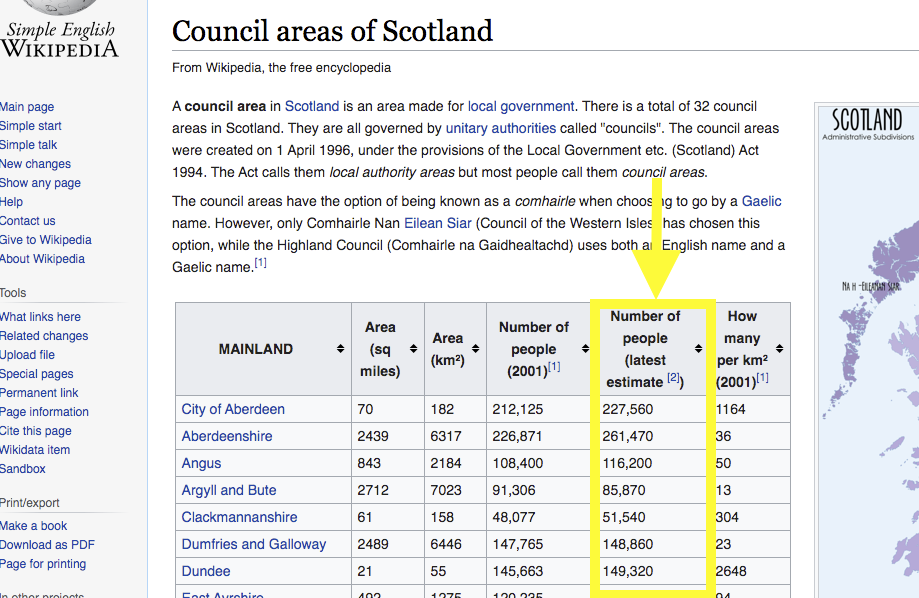

= An exploration of uploading a dataset into Wikidata

This is a short exploration of the steps involved in uploading a dataset into Wikidata
and the usefulness of this.

== About the dataset

The dataset to be uploaded is a slice of the
http://statistics.gov.scot/data/population-estimates-current-geographic-boundaries[Population Estimates]
data cube from statistics.gov.scot. This slice provides: _the population per Scottish council area per year_.

== Uploading the datset

An link:dataset-into-wikidata.ipynb[executable notebook] steps through the detail. The main steps are:

. Reconcile the Scottish council area records in Wikidata with those from statistics.gov.scot.
** Establish how to identity the council area entities in both statistics.gov.scot and Wikidata.
** statistics.gov.scot identifies council areas by 9-character codes.
E.g. http://statistics.gov.scot/id/statistical-geography/S12000030[S12000030]
identifies the Stirling council area.
** Happily, the same codes can also be used to identify the Scottish council areas in Wikidata.
** Compare Wikidata's council area codes against statistics.gov.scot's.
** When this comparison was first executed it discovered that Wikidata's code
for https://www.wikidata.org/wiki/Q207111[North Lanarkshire]
was incorrect, so I amended it directly via editing its web page.
. Reconcile the population records in Wikidata with those from statistics.gov.scot.
** SPARQL queries are used to fetch population values from statistics.gov.scot and Wikidata,
and these are compared.
** When this comparison was first executed it discovered 583 differences:
574 were population records that didn't exist in Wikidata;
9 were population records those Wikidata values differed from those from statistics.gov.scot.
** I manually edited Wikidata to fix a few of those differences.
However, this was laborious, so I decided to introduce some automation by
using https://quickstatements.toolforge.org/[QuickSatements].
** QuickStatements accepts CSV input - representing edits to be applied to Wikidata.
I generated the quickStatements CSV input using a script -
the link:population-values-quickstatements-2020-09-09T11_20GMT.csv[resulting CSV file]
specified 2232 individual edits to Wikidata. These were successfully executed (taking about 30 mins)
against Wikidata by QuickStatements. (Unfortunately QuickStatements does not yet
support a means to set the `rank` of a _triple_ so I had to individually edit the 32 council
area pages to mark, in each, its 2019 population value as the `Preferred rank` population value
...indicating that it is the most up-to-date population value.)

== The usefulness of the uploaded dataset

The uploaded dataset can be pulled (_de-referenced_) into Wikipedia articles and other web pages.

=== Embedding dataset values into Wikipedia articles
As an example, I edited the Wikipedia article
https://simple.wikipedia.org/wiki/Council_areas_of_Scotland[Council areas of Scotland] to insert into its main table,
the new column "_Number of people (latest estimate)_" whose values are pulled
(each time the page is rendered) directly from the data that I uploaded into Wikidata:

=== Embedding dataset based graphs into web pages
And >>https://query.wikidata.org/embed.html#%23defaultView%3ALineChart%0ASELECT%20%0A%20%20%3FcouncilArea%0A%20%20(str(YEAR(%3FpopulationWhen))%20as%20%3Fyear%20)%0A%20%20%3Fpopulation%0A%20%20%3FcouncilAreaLabel%0AWHERE%20%7B%0A%20%20%3FcouncilArea%20wdt%3AP31%20wd%3AQ15060255%20%3B%0A%20%20%20%20%20%20%20%20%20%20%20%20%20%20p%3AP1082%20%3FpopulationEntity%20.%0A%20%20%3FpopulationEntity%20ps%3AP1082%20%3Fpopulation%20%3B%0A%20%20%20%20%20%20%20%20%20%20%20%20%20%20%20%20%20%20%20%20pq%3AP585%20%3FpopulationWhen%20.%0A%20%20SERVICE%20wikibase%3Alabel%20%7B%20bd%3AserviceParam%20wikibase%3Alanguage%20%27%5BAUTO_LANGUAGE%5D%2Cen%27%20.%20%7D%0A%7D[here]<<
is a line graph, dynamically generated from the new Wikidata data, that can be embedded in any web page.

=== Concerns, next steps, alternative approaches
Interestingly, there is https://en.wikipedia.org/wiki/Wikipedia:Requests_for_comment/Wikidata_Phase_2[some discussion]
about the pros & cons of inserting Wikidata values into Wikipedia articles.
The main argument against is the immaturity of Wikidata's structure:
therefore a concern about the durability of the references into its data structure.
The counter point is that early use & evolution might be the best path to maturity.

The case study for our Data Commons Scotland project, is _open data about waste in Scotland_.
So a next step for the project might be to upload into Wikidata, datasets that describe the
amounts of household waste generated & recycled, and 'carbon impact' figures.
These could also be linked to https://www.wikidata.org/wiki/Q15060255[council areas] - as we have done
for the population dataset - to support per council area/per citizen statistics and visualisations.
Appropriate https://www.wikidata.org/wiki/Q18616576[properties] do not yet exist in Wikidata
for the description of such data about waste, so new ones would need to be ratified by the Wikidata community.

Should such datasets actually be uploaded into Wikidata?...
These are small datasets and they seem to fit well enough into Wikidata's knowledge graph.
Uploading them into Wikidata may make them easier to access, de-silo the data
and help enrich Wikidata's knowledge graph.
But then, of course, there is the _keeping it up-to-date_ issue to solve.
Alternatively, those datasets could be pulled dynamically and directly from statistics.gov.scot into Wikipedia
articles with the help of some new MediaWiki https://www.mediawiki.org/wiki/Category:Extensions[extensions].

---

==== Addendum
A link:dataset-CO2e-into-wikidata.ipynb[subsequent] executable notebook explores adding a CO2e dataset into Wikidata,
and then makes use of both the uploaded population and CO2e datasets.