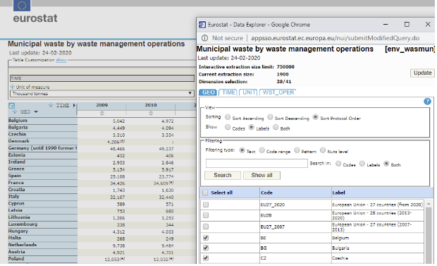

= A look at stats oriented websites in the EU that provide data about waste

== statistics.gov.scot

My https://github.com/data-commons-scotland/dcs-shorts/tree/master/stats-gov-scot-waste-data-investigation/[previous report] looked
at https://statistics.gov.scot/[statistics.gov.scot]‘s machine-oriented SPARQL interface
and praised them for having curated a sizeable number of dataset into linked open data.
Their platform also provides a human oriented web page based interface for:

1. searching through the metadata of all curated datasets;
1. filtering a dataset by dimensions, measures and value ranges to make it more manageable for displaying in a tabular formats or in charts;
1. creating custom combinations of subsets of datasets using its data cart feature.

Feature 1 is intuitive to use.
Features 2 & 3 require some effort (to understand the data model) to use.

(The link:../stats-gov-scot-waste-data-investigation/size-and-shape.ipynb[size-and-shape experiment] shows
how they structure each dataset in terms of dimensions, measures and code-lists.)

== eurostat

The https://ec.europa.eu/eurostat/[eurostat] website makes over 300 million observations
available as open data. It has many nice features including:

* an engaging splash page that informs the user about what’s new,
what’s trending, focus article, popular datasets and indicators;
* a nice https://ec.europa.eu/eurostat/data/database[tree-view navigations] of
the Eurostat datasets;
* some great visualisations (including
https://ec.europa.eu/eurostat/cache/sankey/energy/sankey.html?geos=EU27_2020&year=2018&unit=KTOE&fuels=TOTAL&highlight=_&nodeDisagg=0101000000000&flowDisagg=false&translateX=0&translateY=0&scale=1&language=EN[Sankey] charts
that would be great for
depicting the processing flows of our Scottish waste);
* a highly useful https://ec.europa.eu/eurostat/help/faq[FAQs] section;
* making many of the datasets available as linked data (using the pragmatic
https://ec.europa.eu/eurostat/web/sdmx-infospace/sdmx-explained/what-and-why/sdmx-is-a-business-choice[SDMX] approach);
* a user friendly, intuitive and customisable tabular view of datasets, e.g.:

The link:eurostat-waste-data.ipynb[eurostat-waste-data experiment] investigates
the municipal waste dataset that is shown above.
At the end of the experiment, the percentage of waste recycled per country per year
is calculated and graphed.
https://www.eea.europa.eu/data-and-maps/daviz/municipal-waste-recycled-and-composted-3#tab-chart_3[This graph] –
from the European Environment Agency (EEA) – is used to help corroborate the figures calculated in the lab note.
And the EEA is the subject of the next section.

== European Environment Agency

The https://www.eea.europa.eu/[European Environment Agency] (EEA)
website provides some of the features of its eurostat sister site.
In addition to those, its features of note include:

* 596 linked open data datasets (http://semantic.eea.europa.eu/sparql[accessible] very a seemingly fast SPARQL engine);
* listed with each dataset is a number of pre-defined, informative charts, e.g.

that can be easily re-used in users’ own documents as a static images or as an
interactive charts;
* also, listed with each dataset are the reports and indicators that make use of the dataset.

== Conclusions

There is something to be learnt from these 3 platforms.
Each sets the bar for particular features:

* statistics.gov.scot / its contractor Swirrl IT,
for open sourcing some of its linked open data modelling approaches and tool chain;
* Eurostat for its user friendly navigation over its catalogue of datasets
and for its great tabular presentation of a dataset;
* EEA for maintaining a large number of datasets as (SPARQL supporting, RDF based)
linked open data.