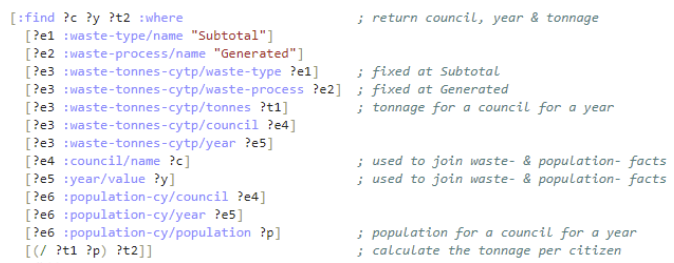

= Linking SEPA and NRS data within a triplestore

I started looking into the realities of uploading the SEPA data about waste (and related)
data into a https://en.wikipedia.org/wiki/Triplestore[triplestore]/semantic graph database,
with a view to turning it into linked data.
My thinking was: tackling the challenges of semantically linking such bulk data
will be a useful learning exercise and will spark interesting ideas…

=== The steps

1. Fetch the SEPA's
link:Household%20Waste%20Data%20Application%20-%20Scottish%20household%20waste%20generation%20and%20management%20(tonnes)%20by%20Local%20Authority.csv[data file about waste tonnes],
parse it, put it into a simple data structure,
and write it to the sepa-waste-data CSV file.
(The details of this step are in the
link:parse-sepa-waste-data.ipynb[parse-sepa-waste-data] executable notebook.)
1. Fetch the National Register of Scotland’s
link:mid-year-pop-est-18-time-series-2.csv[data file about populations],
parse it, put it into a simple data structure,
and write it to the
link:nrs-population-data.csv[nrs-population-data CSV file].
(The details of this step are in the
link:parse-nrs-population-data.ipynb[parse-nrs-population-data] notebook.)
1. Take the datasets output from steps 1 and 2,
and add these into a triplestore to make them available as linked data.
(The details of this step are in the
link:populate-triplestore.ipynb[populate-triplestore] notebook.)
1. Query the linked data in our triplestore to plot some info-graphics.
Here is what a query over the triplestore’s facts - for the
waste tonnage generated per council citizen per year – looks like:

&nbsp;&nbsp;&nbsp;&nbsp;&nbsp;(The details of this step are in the
link:plot-info-graphics.ipynb[plot-info-graphics] notebook.)

=== What was learnt?

* The public triplestores Wikidata and DBpedia are impressive
but their mechanisms for ingesting the kind of bulk data that we are interested in,
are piecemeal, indirect and slow – therefore unsuitable
for our purpose of iterative experimentation with bulk data.
Instead, I used the https://en.wikipedia.org/wiki/Comparison_of_triplestores[Datomic] triplestore because it is simple
and I have had some experience with it.
(Last weekend, Ian and Bruce
https://codethecity.org/what-we-do/hack-weekends/code-the-city-19-history-data-innovation/[coordinated an exercise] that involved
Wikidata and bulk data - its result will be very relevant for this work.)
* The data re-structuring in steps 1, 2 & 3 - to make its information
representable as `subject-predicate-object` facts in a triplestore – was not trivial.
Some aspects of it could be supported by automation but,
I suspect, other aspects require creative input/design decisions.

=== Ideas from this work

Could we develop a platform to support “community curated linked open data
about waste in Scotland”?

* Store all data as linked data to increase its utility.
* Support fast and easy handling of bulk data (i.e. datasets), unlike Wikidata.
** Data re-structuring and linking might require creative input from humans
but the platform could help steer and automate many of the steps.
* Calculate trust/recommender metrics.
** The idea is that such metrics can be used to help resolve conflicts
and converge the data. For example: Sue uploads data that
says that in 2014 23% of the waste generated in the Stirling area was recycled.
Later, Bob uploads data that says that the percentage was 21%.
Which data entry “wins”? We could configure the triplestore to
present both data entries but that probably will lead to data
divergence and less utility. Instead we could configure the
triplestore to present the more trusted data entry… say,
Sue’s if her data entry has a higher "commonshare" than Bob’s.
* Use community curated linked open data as the substrate on
which to build a Scottish waste focussed, community driven website.

I think that there is some novelty/a “USP” in that combination.