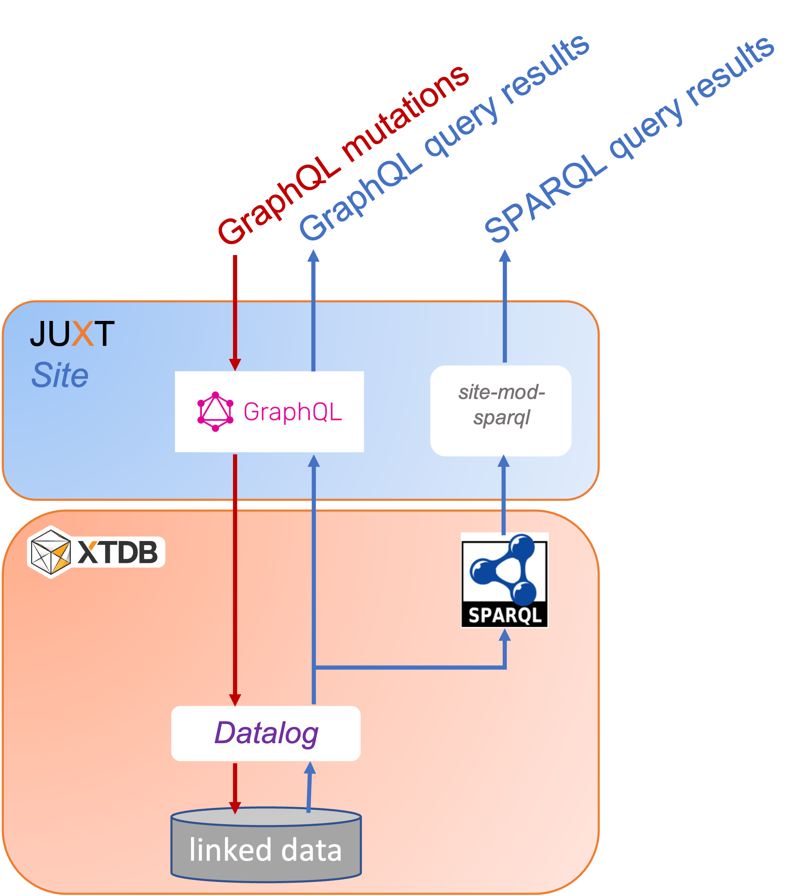

= Linked Open Data using a low-code, GraphQL based approach

> Might https://graphql.org[GraphQL] be an easy means to query https://en.wikipedia.org/wiki/Linked_data[Linked Open Data] (LoD)? +
Moreover, might it even be a handy means for building it?

We use a product called JUXT Site, in exploring these questions. 

== JUXT Site

https://juxtsite.netlify.app[JUXT Site] is a software product which offers a low-code approach for building HTTP-accessible databases.
It has an add-on which allows for those databases (data models with their read & write operations) 
to be defined using GraphQL schemas.

JUXT Site is built on top of a database engine called https://xtdb.com[XTDB] which natively supports
(temporal) graph queries (in the https://en.wikipedia.org/wiki/Datalog[Datalog] language).
It has an add-on which supports (a subset of) https://www.w3.org/TR/rdf-sparql-query/[SPARQL]. 

JUXT Site is Open-source software. 
It is in the _pre-alpha_ phase of development (although its XTDB substrate is production ready). 

So, JUXT Site's has components which make it a promising platform on which to explore the questions at the head of this article.
Here's a diagram which summaries these components: 

(We made a tiny modification (`site-mod-sparql`) to JUXT Site, to surface XTDB's SPARQL support.)

Next, we use JUXT Site's GraphQL to build then query our linked data model.

== Using GraphQL to build our linked data model

We took a subset of  
https://data-commons-scotland.github.io/carbon-savings/doc/building-lod-about-carbon-savings/[the linked data model that we defined for carbon savings] and defined it using a GraphQL schema. The following snippets provide a flavour of that GraphQL definition.  

=== Defining a record _type_ 

A `StcmfRedistributedFood` _record_ says that a batch (weight `batchKg`) of food material was (time period `from` -> `to`) _redistributed_ to a `destination`. (In our linked data model, further information about this - e.g. how the `destination` _repurposes_ the food material, lookup tables to calculate carbon savings, etc. - may be found by following links to other nodes in the data graph.) 

Here is how a `StcmfRedistributedFood` record _type_, is defined in GraphQL (on JUXT Site): 

[source,graphql]
----
""" A batch of redistributed food material """
type StcmfRedistributedFood {
  
  id: ID!
  
  " The start of the period, inclusive "
  from: Date! @site(a: "pasi:pred/from") <1>
  
  " The end of the period, exclusive "
  to: Date! @site(a: "pasi:pred/to")
  
  " How the food material got used "
  destination: StcmfDestination
    @site( <2>
      q: { find: [e]
           where: [[e {keyword: "pasi:pred/type"} "StcmfDestination"]
                   [object {keyword: "pasi:pred/destination"} e]]
         }
    )
  
  " The weight in kilograms of this batch of food material "
  batchKg: Float! @site(a: "pasi:pred/batchKg")
}
----

<1> In GraphQL, a _directive_ (`@(...)`) can be used to say how a field should be mapped to/from to the underlying system. +
+
In JUXT Site, `@site(...)` directives are used to map to/from structures in the underlying XTDB database. 
On this specific line, `a:` says that the field named `from` at the GraphQL level, should be mapped from 
the field named `pasi:pred/from` at the XTDB level. +
+
At the XTDB level, we use names like `pasi:pred/from` for our fields
because such names are https://datatracker.ietf.org/doc/html/rfc3987[IRI]-compliant,
which means that they can be used as https://www.w3.org/TR/rdf-schema/#ch_predicate[RDF predicate]s
and queried using https://www.w3.org/TR/rdf-sparql-query/[SPARQL].

<2> In this directive, we use the Datalog language to code how to find the appropriate `StcmfDestination` record in the underlying XTDB database. 

=== Defining a _query_

Here is how a _query_ operation to return all `StcmfRedistributedFood` records, is defined in GraphQL (on JUXT Site): 

[source,graphql]
----
type Query {

  """ Return all records about batches of redistributed food material """
  stcmfRedistributedFood: [StcmfRedistributedFood]! <1>
}
----

<1> Simply declare that this returns a list (`[...]`) of `StcmfRedistributedFood` records, and JUXT Site will take care of the implementation details.

=== Defining a _mutation_

Here is how a _mutation_ operation to create or update a `StcmfRedistributedFood` record, is defined in GraphQL (on JUXT Site): 

[source,graphql]
----
type Mutation {

  """ Create or update a record about a batch of redistributed food material """
  upsertStcmfRedistributedFood(

    id: ID
      @site(
        a: "xt/id"
        gen: {
          type: TEMPLATE 
          template: "pasi:ent/StcmfRedistributedFood/{{from}}/{{to}}/{{destination}}" <1>
        }
      )

      " The start of the period, inclusive "
      from: Date! @site(a: "pasi:pred/from")

      " The end of the period, exclusive "
      to: Date! @site(a: "pasi:pred/to")

      " How the food material got used "
      destination: String! <2>
      destinationRef: ID 
        @site( 
          a: "pasi:pred/destination"
          gen: {
            type: TEMPLATE 
            template: "pasi:ent/StcmfDestination/{{destination}}"
          }
        )

      " The weight in kilograms of this batch of food material "
      batchKg: Float! @site(a: "pasi:pred/batchKg")

  ): StcmfRedistributedFood @site(mutation: "update")
}
----

<1> We specify that a `StcmfRedistributedFood` record is identified by an IRI-compliant,
https://en.wikipedia.org/wiki/Natural_key[natural key], composed from the `from`, `to` and `destination` values.
Uniqueness is enforced over `ID` values so, that combination of  `from`, `to` and `destination` values will
identity one or zero existing record(s).
<2> On invocation, this mutation will be supplied with a String value for the `destination` parameter.
The `destination` String value is used to construct the `ID` of the targeted `StcmfDestination` record, 
and this `ID` is stored in a field named `pasi:pred/destination` in the underlying XTDB database.

== Querying our linked data model

We used JUXT Site's GraphQL to build our linked data model (in terms of data structures and operations).
Now let's see what querying our data model looks like - firstly using GraphQL, then using SPARQL.

We will query not only for our `StcmfRedistributedFood` records but also for the associated information that we would need to create a _waste reduction_ report which includes estimates of carbon savings. (Although we haven't discussed this associated information in this article, querying for it will make this exploration more informative.)

=== Querying using GraphQL

The query:

[source,graphql]
----
query PASI {
  stcmfRedistributedFood {
    batchKg
    from
    to
    destination {
      name
      refDataConnectors { <1>
        fraction
        refMaterial {
          carbonWeighting
          wasteStream
        }
        refProcess {
          name
        }
        enabler {
          name
        }
      }
    }
  }
}
----

<1> We haven't discuessed it in this article but we introduced an _artificial_ direct connection,
called `refDataConnectors`,  into our data model to allow a query _to walk_ easily to the _reference data_ 
records that are needed to report on carbon savings.

The query's raw result (truncated):
[source,json]
----
{
  "data": {
    "stcmfRedistributedFood": [
      {
        "batchKg": 87.61,
        "from": "2021-01-28",
        "to": "2021-01-29",
        "destination": {
          "name": "Used for human-food, bio-etc & sanctuary",
          "refDataConnectors": [
            {
              "fraction": 0.2,
              "refMaterial": {
                "carbonWeighting": "2.7",
                "wasteStream": "Mixed Food and Garden Waste (dry AD)"
              },
              "refProcess": {
                "name": "recycling"
              },
              "enabler": {
                "name": "Stirling Community Food"
              }
            },
            {
              "fraction": 0.8,
              "refMaterial": {
                "carbonWeighting": "4.35",
                "wasteStream": "Food and Drink Waste (wet AD)"
              },
              "refProcess": {
                "name": "reusing"
              },
              "enabler": {
                "name": "Stirling Community Food"
              }
            }
          ]
        }
      },
      {
        "batchKg": 0.48,
        "from": "2021-01-28",
        "to": "2021-01-29",
        "destination": {
          "name": "Used for compost-indiv",
          "refDataConnectors": [
            {
              "fraction": 1,
              "refMaterial": {
                "carbonWeighting": "3.48",
                "wasteStream": "Food and Drink Waste (Composting)"
              },
              "refProcess": {
[TRUNCATED]
----

The query's result after formatting into a tabular report and calculating the `carbonSaving` column: 

[cols=*]
|===
|                :enabler |      :from |        :to | :batchKg |                         :foodDestination | :ref_process |                     :ref_wasteStream | :ref_carbonSavingCo2eKg 
| Stirling Community Food | 2021-01-28 | 2021-01-29 |     0.48 |                   Used for compost-indiv |    recycling |    Food and Drink Waste (Composting) |                    1.67 
| Stirling Community Food | 2021-01-28 | 2021-01-29 |    17.52 | Used for human-food, bio-etc & sanctuary |    recycling | Mixed Food and Garden Waste (dry AD) |                   47.31 
| Stirling Community Food | 2021-01-28 | 2021-01-29 |    70.09 | Used for human-food, bio-etc & sanctuary |      reusing |        Food and Drink Waste (wet AD) |                  304.88 
| Stirling Community Food | 2021-01-29 | 2021-01-30 |     8.00 |                   Used for compost-indiv |    recycling |    Food and Drink Waste (Composting) |                   27.84 
| Stirling Community Food | 2021-01-29 | 2021-01-30 |    56.02 | Used for human-food, bio-etc & sanctuary |    recycling | Mixed Food and Garden Waste (dry AD) |                  151.26 
| Stirling Community Food | 2021-01-29 | 2021-01-30 |   224.10 | Used for human-food, bio-etc & sanctuary |      reusing |        Food and Drink Waste (wet AD) |                  974.82 
|===

=== Querying using SPARQL

https://www.w3.org/TR/rdf-sparql-query/[SPARQL] is used extensively by the 
https://en.wikipedia.org/wiki/Open_data[Open Data] community 
to query https://www.w3.org/TR/rdf11-datasets/[RDF datasets]/graph databases.

Our chosen platform, JUXT Site (with XTDB), supports (a subset of) SPARQL.
And we have defined our GraphQL-built data model to include RDF/SPARQL compliant names (i.e. IRI names 
for records and predicates/fields). So we can use SPARQL to query our data.

Here's the SPARQL (almost) equivalent of the above GraphQL query:

[source,sparql]
----
PREFIX pasi: <pasi:pred/> <1>
SELECT ?enabler ?from ?to ?batchKg ?foodDestination ?ref_process ?ref_wasteStream ?ref_carbonSavingCo2eKg 
WHERE {
  ?stcmfRedistributedFood pasi:type "StcmfRedistributedFood" ; <2>
                          pasi:from ?from ;
                          pasi:to ?to ;
                          pasi:batchKg ?origBatchKg ;
                          pasi:destination ?destination .
  ?destination pasi:name ?foodDestination .
  ?opsAceToRefData pasi:type "OpsStcmfToRefData" ; <2>
                   pasi:destination ?destination ;
                   pasi:fraction ?fraction ;
                   pasi:refMaterial/pasi:wasteStream ?ref_wasteStream ;
                   pasi:refMaterial/pasi:carbonWeighting ?carbonWeighting ;
                   pasi:refProcess/pasi:name ?ref_process ;
                   pasi:enabler/pasi:name ?enabler .
  BIND((?origBatchKg * ?fraction) AS ?batchKg) <3>
  BIND((?batchKg * ?carbonWeighting) AS ?ref_carbonSavingCo2eKg) <3>
}
ORDER BY ?enabler ?from ?to"
----

<1> We use `pasi` as the _scheme_ part of all our IRIs. 
_PASI_ is our an abbreviation for the (waste reduction) case study whose data model we've sampled in this article. 
It's kind-of our _root-level namespace_.

<2> This SPARQL query uses two _graph entry points_ `StcmfRedistributedFood` and `OpsStcmfToRefData`
in order _to walk_ to all the required graph nodes.
Whereas, in GraphQL, we introduced an _artificial_ direct connection,
(`refDataConnectors`) which allowed the query _to seamlessly walk_ to all the required graph nodes
from a single _graph entry point_.

<3> The `carbonSavings` calculation is performed in SPARQL query.
Whereas, with GraphQL, we performed the calculation outside of the query. 
Although, we could add an explicit `carbonSavings` field into data model 
with a GraphQL directive which specifies how to perform the calculation.

This SPARQL query can support the same tabular report as that supported by the GraphQL query, 
so we won't bother (re)displaying that tabular report here.  

== Conclusions

* JUXT Site offers an appealing low-code, GraphQL based approach for defining transactional, 
linked data systems.
It's a _pre-alpha_. 
Its sweet spot will probably be to back websites where humans drive query and transaction volumes.
* With is ability to support RDF data models and SPARQL, it is a promising platform for Open Data.
Currently it supports only a subset of SPARQL but (again) it is _only_ a pre-alpha.
* So, "might GraphQL be an easy means to query Linked Open Data?". +
+
Well, GraphQL was designed to describe the services that apps use.
But, its query syntax is easier to understand that SPARQL's 
(compare the above GraphQL and SPARQL queries) -
so there is something to be said for providing a GraphQL interface as a means 
to explore an open dataset. 
With the proviso that GraphQL is more abstract/less exact than SPARQL,
and it doesn't directly support federated queries. +
+
They are, of course, different beasts. 
But a platform which is capable of supporting both over the same data might be a great way of 
servicing the audience for both.
* Also - and we've not addressed these in this article but - the XTDB database (used by JUXT Site)
has a number of other features that are important for transacting Linked Open Data:
immutable records, temporal queries, and upcoming data-level authorisation scheme. 
* We see JUXT Site as a candidate platform on which to prototype our '_PASI_' system
which will allow organisations to: upload their social impact data (including waste reduction data); 
validate it; assure security and track provenance; compose and accumulate it; 
and publish it as open linked data.