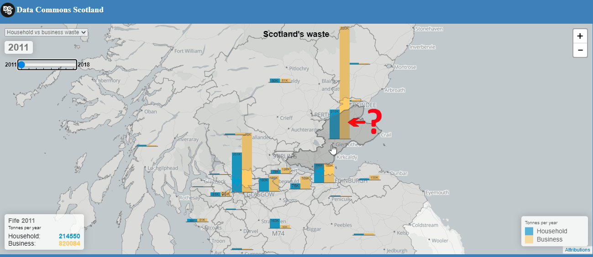
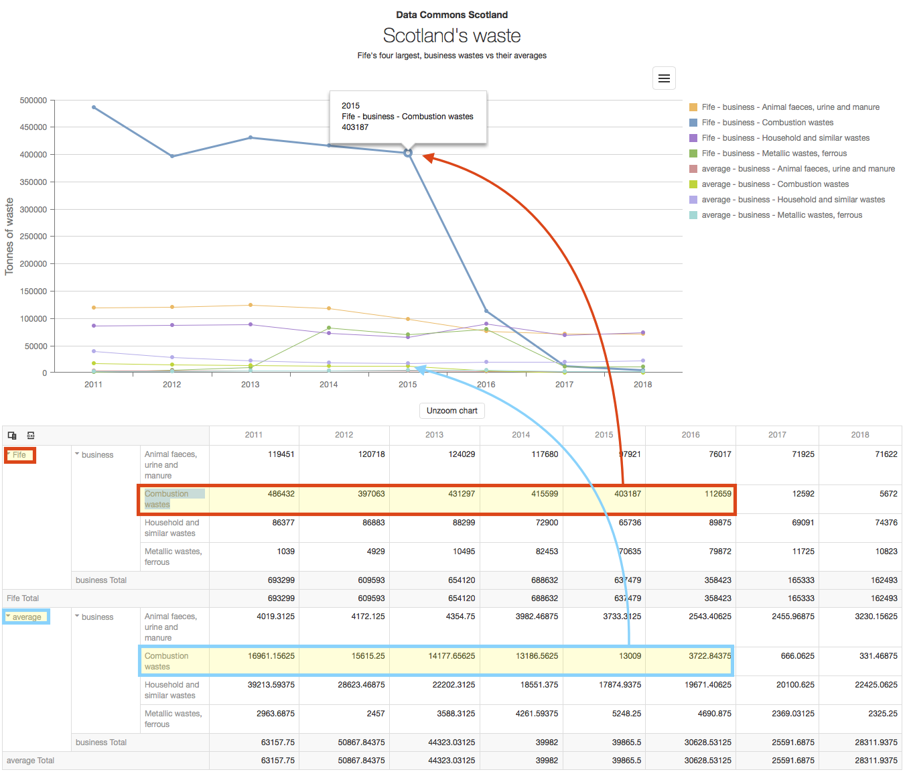
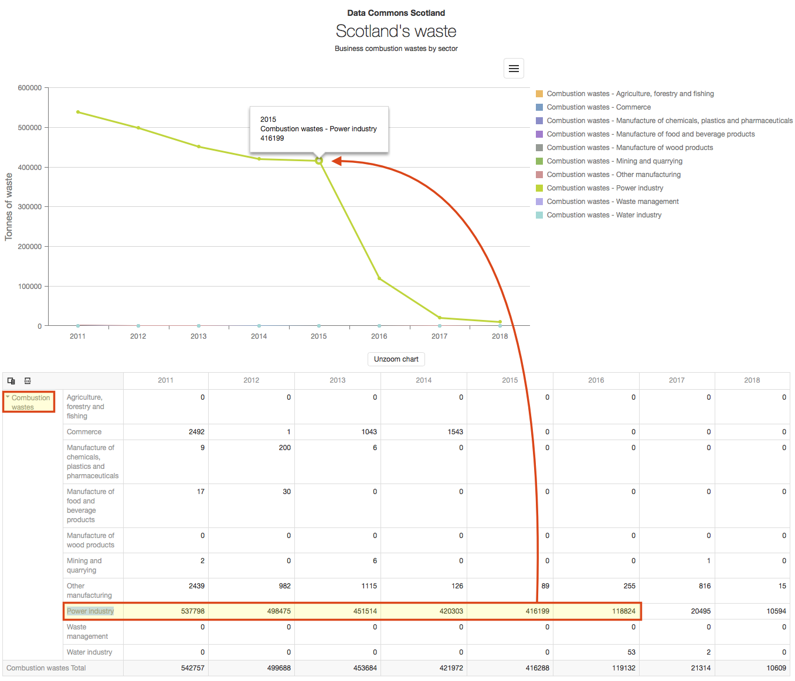
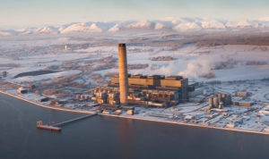

= How I chanced on Longannet in the data

I've added a "Household vs business waste" _time-series_ to our map-oriented webapp from last week.
The business data was parsed from SEPA's https://www.sepa.org.uk/environment/waste/waste-data/waste-data-reporting/business-waste-data/[Business Waste Data Tables,window=_blank].

When I watched the waste quantities change through time data on this map, Fife's quantities really stood out...

Fife was generating so much more waste from business, than the other council areas. *But why?*

To look at the data in more detail, I loaded it into the _data grid & graph tool_ that we
https://github.com/data-commons-scotland/dcs-shorts/blob/master/pivot-drilldown-and-plot/README.adoc[built,window=_blank]
a couple of months ago.

First, I filtered the data grid to show me:
for business waste,
for the highest 4 material quantities,
the Fife quantities versus the council area average
^https://data-commons-scotland.github.io/longannet-found-in-the-data/index.html?preset1[link,window=_blank]^.

Fife's combustion waste stands out from the average.

Secondly, I filtered the data grid to show me:
the business combustion waste quantities by sector
^https://data-commons-scotland.github.io/longannet-found-in-the-data/index.html?preset2[link,window=_blank]^.

Unfortunately this data isn't broken down by area,
but it clearly shows that most of the combustion wastes are generated by the power industry.

An internet search with this information, "Fife combustion power", returns a page full of references
to https://www.powerstations.uk/longannet-power-station-fife-scotland/[Longannet,window=_blank] - the coal fuelled power station.

According to Wikipedia, Longannet power station
https://en.wikipedia.org/wiki/Longannet_power_station[was the 21st most polluting in Europe when it closed,window=_blank],
so no wonder that its signature in the data is so obvious!
It was closed on 24th March 2016, which correlates with
the sharp return towards the average in 2016, of combustion wastes graph line for Fife.

Of course this isn't a real discovery; SEPA, Scottish Power and the people who lived around the power station
will be very familiar with this data _anomaly_ and its cause.
But I think that its mildly interesting that a data lay person like me could discover this from
looking at these simple data visualisations.

