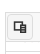
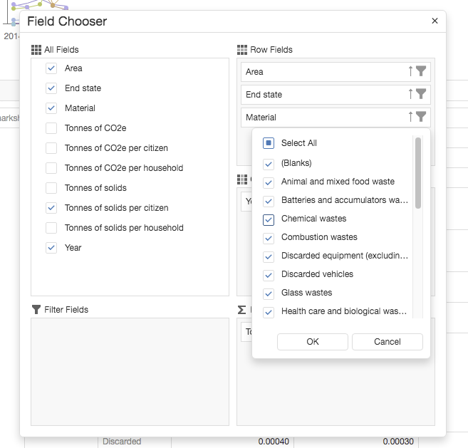

= A prototype data grid & graph over data about waste

The interactive data grid with a linked graph is a tool that is often used to
aggregate, dissect, explore, compare & visualise datasets.
Might such a tool help our users explore and understand open data about waste?
To help answer this, I have hacked together a web-based prototype...

=== The working prototype

The working prototype can be accessed via https://data-commons-scotland.github.io/pivot-drilldown-and-plot/index.html[this link].

=== The data

The prototype pulls together 4 datasets:
[arabic]
.. "Generation and Management of Household Waste" (SEPA).
.. "Carbon footprint" (SEPA)..
.. "Population Estimates (Current Geographic Boundaries)" (NRS).
.. "Mid-Year Household Estimates" (NRS).

The datasets are fetched from statistics.gov.scot and Wikidata, using SPARQL;
then matched; and per-citizen and per-household values calculated.

The result is 50,00 data _facts_.

=== The build

The data was assembled using link:prep-data.ipynb[this executable Jupyter notebook,window=_blank].
For a production-class implementation, that could easily be coded as automated, periodic process.

The web app containing the interactive data grid with a linked graph,
was built using the DevExtreme web component library.
Alternative libraries are viable, but the DevExtreme one is modern and free for non-commercial use.

The resulting data assembly and web app are stored as static files
in https://github.com/data-commons-scotland[the project's GitHub repositories,window=_blank].

=== Its features

The prototype's web page contains a graph and a configurable data grid.
The graph automatically reflects the data selected in the data grid.

image::screenshot-graph-and-grid.png[600,600,align="center"]

Detailed information about a graph's data point is shown when the user hovers over it with the cursor.

The graph can be zoomed/unzoomed, and its current contents can be printed or saved as PNG, PDF, etc.

image::screenshot-graph-saving.png[align="center"]

The data grid's expand/collapse arrow icons allow the user to _drilldown_ into slices of data.

image::screenshot-drilldown.png[align="center"]

The data grid's "Show Filed Chooser" icon pops up a control panel to allow the user
to select data dimensions, value ranges, value filters, display order, etc., etc.

The data grid's "Export to Excel file" icon will export the grid's currently selected data to an Excel spreadsheet.

The resulting Excel files are nice because the export function preserves fixed headers and some other formatting.

image::screenshot-grid-excel-example.png[600,600,align="center"]

The prototype operates okay-ish on phones and tablets.

image::screenshot-ipad.png[400,600,align="center"]

=== Is it useful?

answering questions through presets
    e.g. compare
        data dices, e.g. AberdeenCity vs Dundee
        datastes, e.g. solids vs. CO2e

Would a real version of this be useful for our project?
Maybe not directly for our layman users but perhaps for our users with medium experience of data

