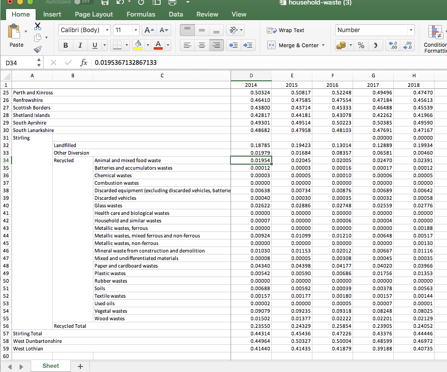

= A prototype data grid & graph over data about waste

The interactive data grid with a linked graph is a tool that is often used to
aggregate, dissect, explore, compare & visualise datasets.
Might such a tool help our users explore and understand open data about waste?
To help answer this, I have hacked together a web-based prototype...

=== The working prototype

The working prototype can be accessed via https://data-commons-scotland.github.io/pivot-drilldown-and-plot/index.html[this link].

=== The data

The prototype pulls together 4 datasets:
[arabic]
.. "Generation and Management of Household Waste" (SEPA).
.. "Carbon footprint [CO2e]" (SEPA)..
.. "Population Estimates (Current Geographic Boundaries)" (NRS).
.. "Mid-Year Household Estimates" (NRS).

The datasets are fetched from statistics.gov.scot and Wikidata, using SPARQL;
then matched; and finally, the per-citizen and per-household values are calculated.

The result is 17,490 data records.

=== The build

The data was assembled using link:prep-data.ipynb[this executable Jupyter notebook,window=_blank].
For a production-class implementation, that could easily be coded as automated, periodic process.

The web app containing the interactive data grid with a linked graph,
was built using the DevExtreme web component library.
Alternative libraries are viable, but the DevExtreme one is modern and free for non-commercial use.

The resulting data assembly and web app are stored as static files
in https://github.com/data-commons-scotland[the project's GitHub repositories,window=_blank].

=== Its features

The prototype's web page contains a graph and a configurable data grid.
The graph automatically reflects the data selected in the data grid.

Detailed information about a graph's data point is shown when the user hovers over it with the cursor.

image::screenshot-graph-hover.png[align="center"]

The graph can be zoomed/unzoomed, and its current contents can be printed or saved as PNG, PDF, etc.

The data grid's expand/collapse arrow-head icons allow the user to _drilldown_ into slices of data.
Below, we've expanded the `Stirling` -> `Recycled` slice to reveal the data values `per-material`.

The data grid's "Show Filed Chooser" icon pops up a control panel to allow the user
to select data dimensions, axis assignments, value ranges, value filters, display order, etc., etc.

image::screenshot-field-chooser-icon.png[50,50,align="center"]

image::screenshot-field-chooser-panel.png[align="center"]

The data grid's "Export to Excel file" icon will export the grid's currently selected data to an Excel spreadsheet.

image::screenshot-grid-excel-icon.png[50,50,align="center"]

The resulting Excel files are nice because the export functionality
preserves user-friendly fixed headers and some other formatting.

Finally, the prototype operates well on phones and tablets (although there is
a sizing issue with pop-up panels that I haven't investigated).

image::screenshot-iphone.png[200,250,align="center"]

=== But, is it useful?

So, might (a production-class version of) such a tool,
help our users to explore and understand open data about waste?
Well, we won't know until we have user tested it, but my guess is that:

[loweralpha]
. users with no data analysis experience
will find its configurability difficult to navigate.
. users with low-to-medium data analysis experience
may find it a useful as a single tool containing multiple datasets.
. users with medium-to-high data analysis experience
will prefer to use their own tools.

A _presets_ feature has been added to the tool
so that users can go to a particular configuration & data selection
by simply clicking on a hyperlink.
This supports an _easy-access_ route to the tool for users with no data analysis experience,
by answering their potential questions through _presets_ such as:

[arabic]
. https://data-commons-scotland.github.io/pivot-drilldown-and-plot/index.html?preset1[How does Aberdeen City compare with Dundee (and Scotland as a whole) for the amounts of household waste per citizen that it landfills?]
. https://data-commons-scotland.github.io/pivot-drilldown-and-plot/index.html?preset2[How many tonnes of each household waste material ended up recycled, landfilled, etc. in Stirling in 2018?]
. https://data-commons-scotland.github.io/pivot-drilldown-and-plot/index.html?preset3[What proportion of a tonne of household waste has ended up recycled, landfilled, etc. in Edinburgh through the years?]
. https://data-commons-scotland.github.io/pivot-drilldown-and-plot/index.html?preset4[What does the correlation look like between the amounts of household waste solids and their calculated carbon impacts?]

