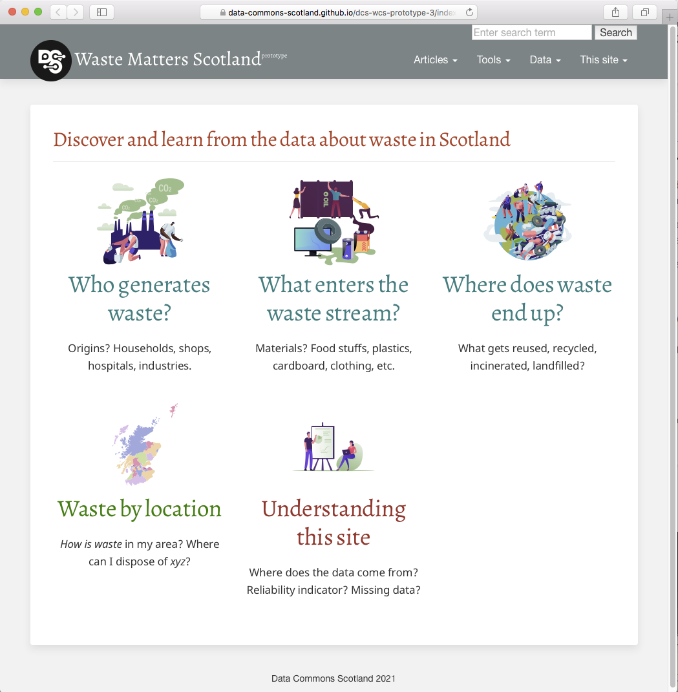

= A mock-up website for functionality & navigation

=== Introduction

A prototype website will be one of the outcomes of this research project.
The website should help non-experts discover, learn about and understand the open data about waste in Scotland.

To date, we have build a couple of mock-ups
footnote:[We use the term "mock-up" to mean an incomplete representation/model - useful for
demonstration, design evaluation and acquiring user feedback.]:
[lowerroman]
. A https://data-commons-scotland.github.io/dcs-wcs-prototype-3/index.html[functionality &amp; navigation mock-up]
for exploring ideas about functionality and navigation for our eventual website.
. A http://datacommonsscot.uk.w3pcloud.com[look'n'feel mock-up]
for exploring looks/visual aesthetics.

This document concentrates on the functionality &amp; navigation mock-up...

=== Functionality

This mock-up ties together a lot of the elements we've been working on:

[horizontal]
[blue]#*Data*#:: Direct access to download the underlying datasets. +
[gray]#A simple, consistent set of CSV and JSON files.#
[green]#*Maps*#:: Interactive, on-map depictions of the information from the datasets.
[navy]#*Data grids with graphs*#:: A tool for _slicing'n'dicing_ the datasets and visualising the result as a graph. +
[gray]#To make this easier, this tool will provide useful _slicing'n'dicing_ presets: starting points from which users can explore.#
[maroon]#*SPARQL*#:: A query interface to a semantic web representation of the datasets. +
[gray]#This is unlikely to be of use to our target audience, so we'll probably remove it from the UI.#
[teal]#*Articles*#:: Themed articles and tutorials that are based on evidence from the datasets. +
[gray]#Uses https://powerman.name/doc/asciidoc[Asciidoc] mark-up to make the articles easy to format. +
The articles may incorporate data vizualisations that are backed by our datasets.#

=== Navigation

The mock-up provides 3 routes to information:

[horizontal]
[teal]#*Themes*#:: The clickable _blocks_ on the splash page allows users to explore a _waste theme_ by taking the user to a specific set of of articles and tutorials. +
[olive]#*Navbar*#:: The menu bar at the top of each page, provides an orthogonal, more 'functional' classification of the website's contents.
[maroon]#*Search*#:: [gray]#At present, this is a very basic text &amp; tag search.
In the future, a predicative/auto-suggestion search based on a semantic graph of the contents, will be provided.#

[gray]#Users navigation histories may help power a further-reading recommendation subsystem.#

=== Architecture

Building this mock-up has required some _architectural_ decisions that may help inform the design of our eventual website.

[horizontal]
[olive]#*Static website*#:: The mock-up has been implemented as a so-called 'static website'.
This means that page content is not dynamically generated by (or saved to) the server-side.
The server-side simply serves 'static content files'. +
+
--
[horizontal]
*Pros*:: Implementation-wise, it is an order of magnitude simpler and more scalable than a 'dynamic' website. +
There are several good, free, open source 'static website generators/frameworks'. +
Static websites can be served for free on hosting platforms such as GitHub
(as used for this mock-up).
*Cons*:: It can't support a whole class of functionality that
includes user uploads, and _on-line_ content editing. +
Computation is forced towards the client-side (i.e. into users' web browsers)
which sometimes can have a negative impact on the speed of the UI.
--
[navy]#*Off-line updates*#:: The content of the website can be updated - just not _on-line_.
The website maintainers can add new/edit existing datasets, articles, etc. via _off-line_ means. +
[gray]#For off-line updates to this mock-up we use:
(i) WDT - a rough'n'ready software script that helps us to curate the datasets that underlay this mock-up;
(ii) Cryogen - a static website generator;
(iii) Git - to upload updates to our GitHub hosting service.#
[maroon]#*Client-side computation*#:: Page content is dynamically manipulated (e.g. datasets are _slice'n'diced_)
on the client-side (in users' web browsers) using JavaScript.
This enables, for example, the mock-up's web pages to take the static content
that is served by the server-side, and manipulate it so that it can support
interactive data visualisations. +
[gray]#Modern client-side technology #

=== Conclusion

as something concrete to focus on and evolve.
It has some of the branding & graphics we've been working on, but that really isn't its purpose.
