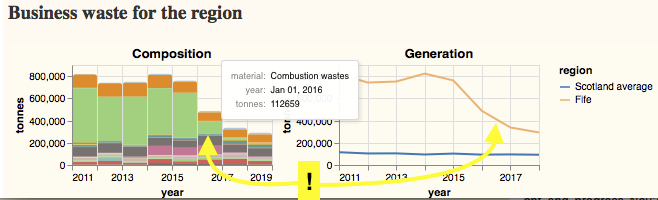

= "_How is waste_ in my area?" - a regional dashboard

== Introduction

Our aim in this piece of work is:
[quote]
to surface facts of interest (max/mins, trends, etc.)
about waste in an area, to non-experts.

Towards that aim, we have built a prototype *_regional dashboard_*
which is directly powered by our
https://github.com/data-commons-scotland/dcs-easier-open-data['easier datasets']
about waste.

The prototype is a webapp and it can be accessed https://data-commons-scotland.github.io/prototype-6/#/regional-dashboard[*here*].

== Curiosities

Even this early prototype manages to surface some curiosities footnote:[One of the original sources of data has been off-line due to a cyberattack so, at the time of writing, it has not been possible to double-check all figures from our prototype against original sources.]
...

==== Inverclyde

Inverclyde is doing well.

In the latest data (2019), it generates the [green]#fewest# tonnes of household waste (per citizen) of any of the council areas.
And its same [green]#1^st^# position for CO~2~e indicates the close relation between the amount of waste generated and its carbon impact.

[teal]#_...But why is Inverclyde doing so well?_#

==== Highland

Highland isn't doing so well.

In the latest data (2019), it generates the [red]#most# (except for Argyll & Bute) tonnes of household waste (per citizen) of any of the council areas.
And it has the [red]#worst# trend for percentage recycled.

[teal]#_...Why is Highland's percentage recycled been getting worse since 2014?_#

==== Fife

Fife has the [green]#best# trend for household waste generation.
That said, it still has been generating an above the average amount of waste per citizen.

The graphs for Fife business waste show that there was an acute [green]#reduction#
in combustion wastes in 2016.

We investigated this _anomaly_
https://github.com/data-commons-scotland/dcs-shorts/tree/master/longannet-found-in-the-data[before]
and discovered that it was caused by the closure of Fife's coal fired
power station (Longannet) on 24th March 2016.

==== Angus

In the latest two years of data (2018 & 2019), Angus has noticibly [green]#reduced# the amount of household waste that it landfills.

During the same period, Angus has increased the amount household waste that it processes as 'other diversion'.

[teal]#_...What underlies that difference in Angus' waste processing?_#

== Technologies

This prototype is built as a 'static' website
with all content-dynamics occurring in the browser.
This makes it simple and cheap to host,
but results in _heavier_, more complex web pages.

* The clickable map is implemented on Leaflet - with Open Street Map map tiles.
* The charts are constructed using Vega-lite.
* The content-dynamics are coded in ClojureScript - with Hiccup for HTML, and Reagent for events.
* The website is hosted on GitHub.

== Ideas for evolving this prototype

[lowerroman]
. Provide more _qualitative_ information.
This version is quite _quantitative_ because, well, that is nature of the
datasets that currently underlay it.
So there's a danger of straying into the "_managment by KPI_" approach
when we should be supporting the "_management by understanding_" approach.
. Include more localised information, e.g. about an area's re-use shops, or bin collection statistics.
. Support _deeper dives_, e.g. so that users can click on a CO~2~e trend to navigate to a choropleth map for CO~2~e.
. Allow users to download any of the displayed charts as (CSV) data or as (PNG) images.
. Enhance the support of comparisons by allowing users to _multi-select_ regions and overlay their charts.
. Allow users to choose from a menu, what chart/data tiles to place on the page.
. Provide a _what-if?_ tool.
"What if every region reduced by 10% their landfilling of waste material xyz?" - where the tool
has a good enough _waste model_ to enable it to compute _what-if?_ outcomes.