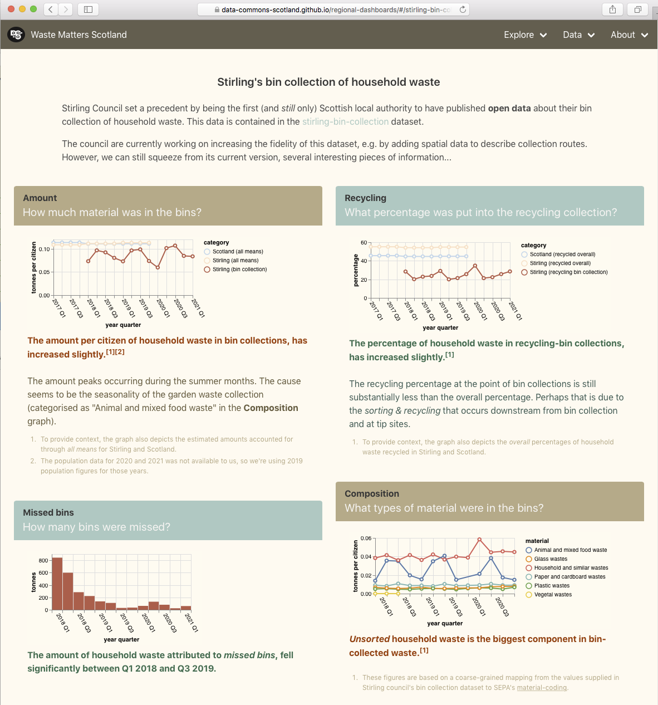

= Stirling's bin collection data - revisited

Stirling Council set a precedent by being the first (and _still_ only)
Scottish local authority to have published *open data* about their
bin collection of household waste.

The council are currently working on increasing the fidelity of this dataset,
e.g. by adding spatial data to describe collection routes.
However, we can still squeeze from its current version,
several interesting pieces of information.
For details, visit the
https://data-commons-scotland.github.io/prototype-6/#/stirling-bin-collection[Stirling bin collection page]
on our website mockup.

