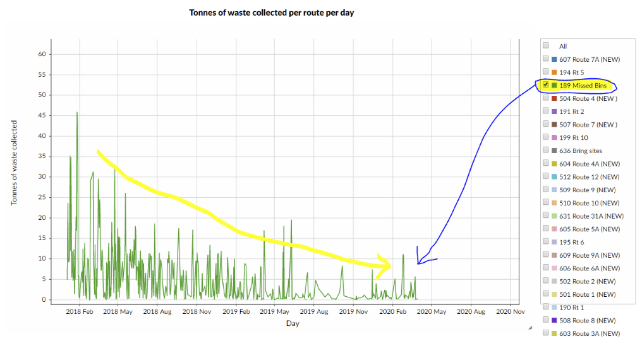

= Stirling Council’s waste-management dataset as linked open data

Kudos to Stirling Council for being the
https://github.com/data-commons-scotland/dcs-shorts/blob/master/open-data-about-waste-in-scotland/README.md[only] Scottish
local authority to have published household waste collection data as open data.
This data is contained in their https://data.stirling.gov.uk/dataset/waste-management[waste-management] dataset.
It consists of:

* Core data, per year CSV files.
* Metadata that includes a basic schema for the CSV files, maintenance information and a descriptive narrative.

For that, Stirling Council have attained _3 stars_ on https://5stardata.info/en/[this] openness measure.

To reach 5 stars, that data would have to be turned into _linked open data_,
i.e. gain the following:

* https://en.wikipedia.org/wiki/Uniform_Resource_Identifier[URI]s denoting things.
E.g. have a URI for each waste type, each collection route and each measurement.
* Links to other data to provide context. E.g. reference commonly accepted
identifiers/URIs for dates, waste types and route geographies.

This week I investigated aspects of what would be involved in gaining those extra two stars.

The link:original-data-to-cube.ipynb[original-data-to-cube notebook]
steps through the nitty-gritty of doing that. The steps include:

1. Mapping the data
into https://www.w3.org/TR/vocab-data-cube/[the vocabulary for the statistical data cube] structure
– as defined by the W3C and used by the Scottish government’s statistic office.
1. Mapping the date values to the
http://reference.data.gov.uk/[date-time related vocabulary] –
as defined by the UK government.
1. Defining placeholder vocabularies for waste type and collection routes.
Future work would be to: map waste types to (possibly “rolled-up” values) in
a SEPA defined vocabulary; and map collection routes to a suitable geographic vocabulary.
1. Converting the CSV source data into RDF data in accordance to the above mappings.
This results in a set of .ttl – RDF Turtle syntax – files.
1. Loading the .ttl files into a triplestore database so that their linked data graph
can be queried easily.
1. Running a few SPARQL queries against the triplestore to sanity-check
the linked data graph.
1. Creating an example infographic (showing the downward trend in missing bins)
from the linked data graph:

=== Conclusions

* It took a not insignificant amount of consideration to convert
the 3-star non-linked data to (almost) 5-star linked data.
But I expect that the effort involved will tail off if we similarly
converted further datasets, because of the experience and knowledge gained along the way.
* Having a linked data version of the waste-management dataset promises to make
its information more explicit and more compostable.
But for the benefits to be fully realised, more cross-linking needs to be carried out.
In particular, we need to map waste types to a common (say, SEPA controlled) vocabulary;
and map collection routes to a common geographic vocabulary.
* We might imagine that if such a linked dataset were to be published & maintained –
with other local authorities contributing data into it – then SEPA would be able
to directly and constantly harvest its information so, making period report preparation
unnecessary.
* JimT and I have discussed how the Open Data Phase2 project might push for the
publication of linked open data about waste, using common vocabularies,
and how our Data Commons Project could aim to fuel its user interface using that
linked open data.
In order words, the linked open data layer is where the two project _meet_.