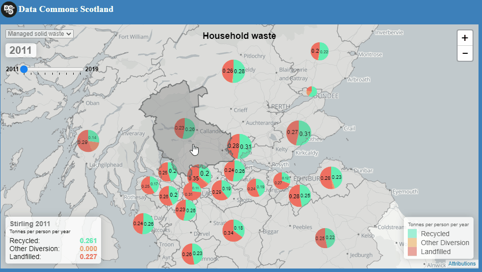
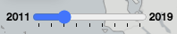
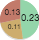
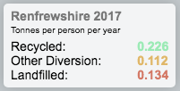
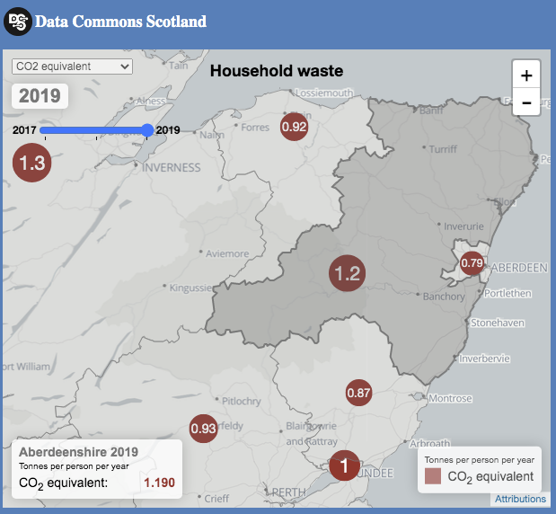

= Waste quantities through time, on a map

WARNING: A work-in-progress.

== Preface

Shortly before the end of 2020, I attended the
https://codethecity.org/what-we-do/hack-weekends/code-the-city-21-put-your-city-on-the-map/[Code The City 21: Put Your City on the Map]
_hack weekend_ which explored ideas for putting open data onto geographic maps.

It ran several interesting projects.
There was one was especially inspiring to me: the Bioregion Dashboard.
Its idea is to tell an evidence-backed _story-through-the-years_,
involving interactive data displays against a map.
James Littlejohn introduces it in https://youtu.be/C0OSjIu3ZT4[this YouTube video].

This got me thinking about new ways to depict the information that is bound up
in the data about waste...

In particular, about a means to convey _at-a-glance_, to the lay person, how councils areas
compare through time in respect of the amounts of (household solid) waste that they
process. Now, the
https://github.com/data-commons-scotland/dcs-shorts/blob/master/pivot-drilldown-and-plot/README.adoc[grid & graph prototype]
that we built a couple of months back,
conveys that same information very well (and with a greater fidelity than we
will mange in this work) but, it isn't attention grabbing for the lay person - like me.
I like seeing something with movement and with features that I can relate to,
such as animated charts and a geographical map.

== The prototype webapp

Leveraging what I learnt at the Code the City 21 _hack weekend_,
I hacked together a prototype webapp
that shows how waste quantity change through time, on a geographic map.

The below, animated image of the webapp, shows it conveying that
landfilled-waste has reduced over time while total-waste has remained _fairly_ constant.

=== UI controls

* Choose the _dataset of interest_ using the  control, either:
[lowerroman]
. Tonnes of managed solid household waste per person per year.
. Tonnes of C0~2~ equivalent from household waste per person per year.
* Use the  control to _travel through time_.
* Each  chart depicts the waste-related quantities for a council area.
** The sizes of its slices and its overall size, are related to the quantities that it depicts.
* Hover over a council area to see detailed metrics in the  panel.
* The usual map zoom and pan controls are supported.

=== Software and datasets

* The open source https://leafletjs.com/[Leaflet] and https://antares.rte-france.com/[Minichart]
libraries do most of the heavy lifting.
* The map's base layer comes from https://esri.maps.arcgis.com/home/[Esri ArcGIS].
(The images in this document, contain a https://stadiamaps.com/[Stadia Maps] base layer
but this can't be used at runtime without an account.)
* The map's council area boundary data originates from the http://geoportal.statistics.gov.uk/[ONS],
and has been curated by https://github.com/martinjc/UK-GeoJSON[Martin Chorely].
* The datasets....

=== 'Live' instance

A 'live' instance of this webapp can be accessed https://data-commons-scotland.github.io/waste-quants-thru-time-on-a-map/index.html[*here*] .

== Closing thoughts

Being a prototype, this webapp is a little rough around the edges however,
I think that it manges to convey the salient information (from the data) in a _catchy_ and easy to understand way.
Of course, it is low fidelity compared to graphs & spreadsheets
but the idea s to appeal to the person in the street.

* Considered alternative metrics (such as ratios), alternative charts (such as bar and polar) 
and alernative statistics (such as deviation and trend)
but went with the 'most straightforward' (user testing might indicate that an alternatives is 'better').
* Generalise to other geo-mappable Scottish data.

