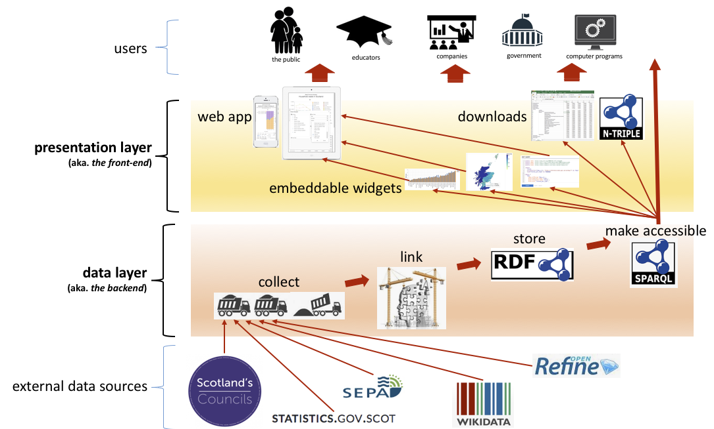
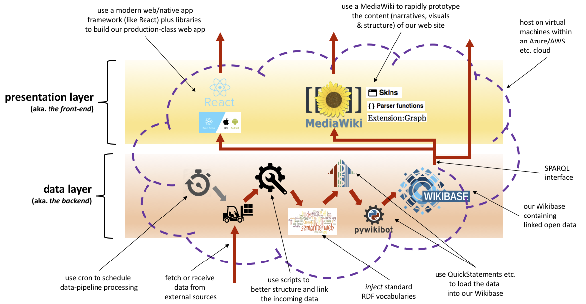
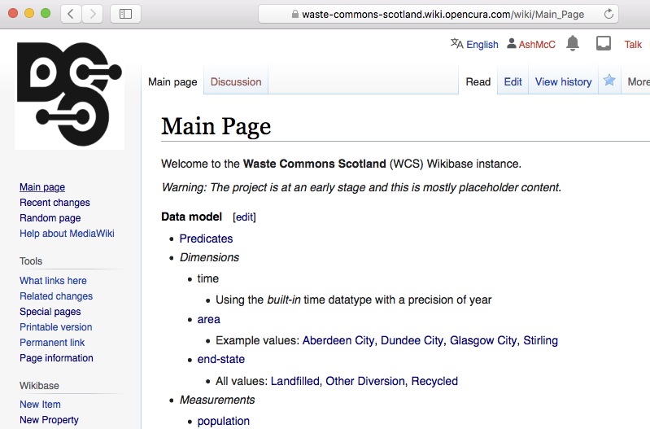
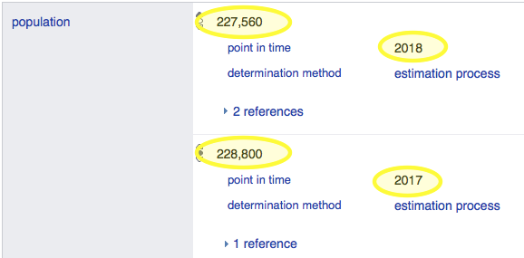
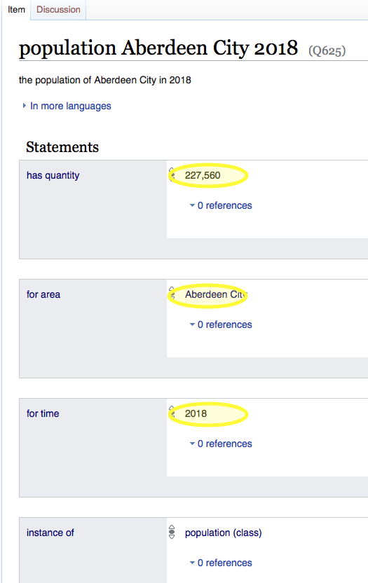
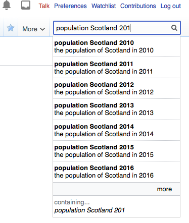

= Trialling Wikibase for our data layer

== Introduction

The architectural proposal for our
https://campuspress.stir.ac.uk/datacommonsscotland/2020/09/22/what-might-a-waste-commons-scotland-platform-look-like-initial-ideas-in-our-design-scenarios/[WCS platform],
contains a *data layer* for collecting, linking, caching and making accessible the source datasets...

NOTE: Our assumption is that, for our near-term aims,
https://en.wikipedia.org/wiki/Linked_data[linked data]
provides the most useful foundation.

The idea that we're trialling here, is to use https://wikiba.se/[Wikibase] as the core component in our data layer...

== The case for using Wikibase

Wikibase is a proven off-the-shelf solution that makes it easier to work with linked data.
It provides:

* A linked data store.
* An interface for humans to view and manually edit linked data.
* An API that can be used by computer programs to (bulk) edit linked data.
* SPARQL support. 

So why not just use Wikidata? (Wikidata is Wikibase’s common, public instance.)
...Ideally we would but:

* Our domain specifics aren’t supported in Wikidata. 
** E.g. Wikidata doesn’t (yet) have a full vocabulary to describe waste management.
** We want to experiment and move fast. Wikidata is sensibly cautious about change, therefore too slow for us.
* We can still make use of Wikidata for some aspects of our work by referencing its data, using its vocabulary, and using it to store very general data.

*Novelty*...
The use of a customised Wikibase instance is not novel 
but our intended specific customisation and application does have some novelty:

* Wikibase provides easier to use, human-friendly access to linked data than typical triple stores.
+
Will this facilitate more engagement and use, compared with sites with less human-oriented surface area?
…Perhaps a worthwhile study.
+
Also, the greater human-oriented surface area in this solution, should be direct help 
when it comes to implementing user-based features such as a *recommender system*
and community forums.
* By their nature, wiki solutions support crowd sourcing.
+
Our platform could support a limited form of this by encouraging councils, recycling shops, etc.
to contribute their data about waste; data which currently isn’t open or linked.
* Our platform will be built using open & inexpensive (often free) components and services.
+
It should be straightforward to apply the approach to other domains of open data for Scotland.

== Hosting on WBStack

https://www.wbstack.com/[WBStack] is an _alpha_ (software-as-a-service) platform created by by Adam Shorland.
It allows invitees to create their own, publicly accessible Wikibase instances.

Adam invited us to create our own Wikibase instance on his platform. +
Our Wikibase is at https://waste-commons-scotland.wiki.opencura.com

== Populating our Wikibase with data about waste

=== The datasets

In this trial, we want to populate our Wikibase with 4 datasets:

1. `area` - _reference_ data describing administrative areas
1. `population` - _reference_ data describing populations
1. `household waste` - describing the tonnes of solid waste generated by households
1. `co2e` - describing the tonnes of carbon equivalent from household waste

=== The data model

==== Representing a dataset record in Wikibase

Let's consider a couple of records from the `population` dataset:

|===
|Aberdeen City|2018|227,560
|Aberdeen City|2017|228,800
|===

In Wikbase, we could represent each of those records as a _statement_ on the "Aberdeen City "_item_.
This is the approach that we took in our previous work about https://campuspress.stir.ac.uk/datacommonsscotland/2020/09/14/the-usefulness-of-putting-datasets-into-wikidata/[The usefulness of putting datasets into Wikidata?].
This screenshot shows the resulting Wikidata _statements_ ...

The problem with this approach is that it can result in an unwieldy amount of _statements_ per single _item_.

The alternative approach we've taken for out Wikibase, is to represent each of those records as an _item_ in its own right.
So that first record is represented as the Wikibase _item_...

==== Use common predicates and dimensions to link and structure the data

Some predicates and dimensions are common, they are used across most of the datasets.

* _Common_ predicates:
** https://waste-commons-scotland.wiki.opencura.com/wiki/Property:P5[has quantity]
** https://waste-commons-scotland.wiki.opencura.com/wiki/Property:P6[for time]
** https://waste-commons-scotland.wiki.opencura.com/wiki/Property:P7[instance of]
** https://waste-commons-scotland.wiki.opencura.com/wiki/Property:P8[part of]
** https://waste-commons-scotland.wiki.opencura.com/wiki/Property:P9[for area]
* _Common_ dimensions:
** _time_
** https://waste-commons-scotland.wiki.opencura.com/wiki/Property:Q1[area]

Some predicates and dimensions are dataset specific. For example:
the predicate https://waste-commons-scotland.wiki.opencura.com/wiki/Property:P10[has UK government code]
is used only to describe the `area` dataset;
while the dimension https://waste-commons-scotland.wiki.opencura.com/wiki/Property:Q664[end-state]
is used only to describe the `household waste` dataset.

=== Loading the data

I've hacked together a software script - `dcs-wdt` - which writes the datasets into our Wikibase.
It is very rough'n'ready
(however, it might be the seed of something more generic for automatically re-loading our datasets of interest).
Its outline is:

[source,C]
/* order datasets & dataset-aspects, most independent first */
for each dataset in [base, area, population, household-waste, co2e]
  for each dataset-aspect in [class-item, predicates, supporting-dimensions, measurements]
    for each record in the dataset-aspect
      if the record is not already represented in the Wikibase
        write-to-wikibase a property or item to represent the record

== Assessment

> So, should we use a Wikibase as the core component in our data layer?

=== _Pros_

* The bundled *SPARQL* query service and UI work well.
+
Example: https://tinyurl.com/yxgleq38[query for the tonnes of CO2e (from household waste) per citizen per area per year].
+
There is an oddity w.r.t. implicit prefixes but this can be worked around by explicitly declaring the prefixes.
* It has straight out-of-the-box *search* functionality which automatically indexes content,
and provides a search feature (with 'completion-suggestion').
+

+
It is primarily configured for searching _items_ by their _labels_ but it does fall-through to
providing a more _full-text_ type search capability.
* It has a baked-in *API* (in addition to the programmatically accessible SPARQL query service)
which  provides a very full and well https://www.mediawiki.org/wiki/API:Main_page[documented HTTP-based API]
for reading & writing data.
+
(The `dcs-wdt` script makes use of both its SPARQL query service and API.)
* Its human-oriented web pages (*UI*) are sort of nice - making it easy to explore the data, and to perform data management tasks.
* It comes with a raft of features for supporting community-contributed content, including:
https://waste-commons-scotland.wiki.opencura.com/wiki/Special:SpecialPages[user accounts and permissions],
discussion forums, and easy-ish to use bulk data uploads via
https://waste-commons-scotland.wiki.opencura.com/tools/quickstatements/#/[QuickStatements].
I haven't explored these in any depth, but they are potentially useful
if the project decides that supporting user content on the WCS platform, is in-scope.

=== _Cons_

* It doesn't come with all the bells'n'whistles I thought it would...
+
I think that I've been naive in thinking that many of the easy-to-use MediaWiki rendering features
(especially over SPARQL queries) that I've read about
(particularly those of https://www.mediawiki.org/wiki/Extension:LinkedWiki[LinkedWiki]),
would _just-be-there_.
Unfortunately those are all _extras_...
the LinkedWiki extension and its transitive dependencies need to be installed;
the relevant templates imported;
OpenStreetMap etc. access keys must be configured.
+
Those bells'n'whistles are not supported by WBStack and the installation of them would take some expertise.
* WbStack's service has been running for one year now but, as a free _alpha_, it provides no guarantees.
+
For example, a recent update of some of its software stack caused a short outage
and an ongoing problem with label rendering on our Wikibase instance.

=== Conclusions

For the project, the main reason for using Wikibase is two-fold:

[loweralpha]
. Out-of-the-box support for a simple linked data model that can be _SPARQL-ed_.
. The use of the wiki's data-table, graphing & mapping widgets for the rapid prototyping of
and inclusion in WCS web pages.

As it stands, the WBStack Wikibase is useful for (a) but not (b).

I'm thinking that we should _keep it on the back burner_ for now - while we find out what the front-end needs.
Its support of (a) might turn out to be a good enough reason to use it,
although there are alternatives - including use of a standalone triple store;
or, if we have just a few datasets, building our own linking software and file-based store.
Not having (b) means extra work for us to build/configure widgets for graphing, mapping, etc.

